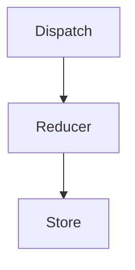

# redux 사용법


## 1. 초기 세팅 (Create)

1. `store.js` 파일을 만든다.
```js
// store.js
import { configureStore, createSlice } from '@reduxjs/toolkit'

// state
let user = createSlice({
  name: 'user',
  initialState: 'kim',
})

let stock = createSlice({
  name: 'stock',
  initialState: [10, 20, 30],
})

let cart = createSlice({
  name: 'cart',
  initialState: [
    {id: 1, name: 'white and black', count: 2},
    {id: 2, name: 'Grey note', count: 1}
  ]
})


// store
store = configureStore({
  reducer: {
    user: user.reducer,
    stock: stock.reducer,
    cart: cart.reducer,
  }
})

export default store
```


1. index.js 파일에서 사용하겠다고 선언
```js
// index.js
import React from 'react';
import ReactDOM from 'react-dom/client';
import store from './store.js'  // import 해서 사용 선언
...

const root = ReactDOM.createRoot(document, getElementId('root'));
root.render(
  <Provider store={store}>
    <BrowserRouter>
      <App />
    </BrowserRouter>
  </Provider>
)
```


## 2. 사용법 (Read)

특정 컴포넌트 파일에서 사용을 위해 `useSelector` 을 가져다 쓴다.
```js
import { useSelector } from 'react-redux';

function Component() {
  let store = useSelector(state => state)
  console.log(store)  // 위에서 저장한 user, stock, cart 들이 저장되어 나온다.

  return (
    <div> {store.user} </div>
  )
}
```


## 3. Store의 state 변경하는법 (Update, Delete)

1. state 을 수정하는 reducers 라는 함수들을 만들고 export 한다.
```js
// state
let user = createSlice({
  name: 'user',
  initialState: 'kim',
  reducers: {  // state을 변경하는 함수들을 담아놓는 곳.
    changeName(state) {
      return 'john ' + state
    },
    chaneName2(state) {
      return ''
    }
  }
})

export let { changeName, 함수2, ... } = user.actions

let stock = createSlice({
  name: 'stock',
  initialState: [10, 20, 30],
  reducers: {
    addStock(state, data) {
      return [...state, data]
    }
  }
})

export let { addStock } = stock.actions

let cart = createSlice({
  name: 'cart',
  initialState: {id: 1, name: 'white and black', count: 2},
  reducers: {
    // Object 자료형은 return 할 필요없이 바로 수정해도 된다.
    changeId(state) {
      state.id = 2
    }
    addCount(state, action) {
      state.count += action.payload
    }
  }
})

export let { changeId, addCount } = cart.actions
```

2. 사용하는 곳에서 reducers 함수들을 이용하여 state을 변경한다

```js
import { changeName } from './../store.js'

function Component() {
  let state = useSelector(state => state)

  // 1. useDispatch() -> store.js 로 요청을 보내주는 친구. (vue에 mutate?)
  let dispatch = useDispatch()

  return (
    <div>Hello</div>
    // 2. dispatch 가 reducer 함수를 호출해야 한다.
    <button onClick={() => { dispatch(changeName()) }}>
      +
    </button>
    <button onClick={() => { dispatch(addCount(100)) }}>
      +
    </button>
  )
}
```

<hr>

