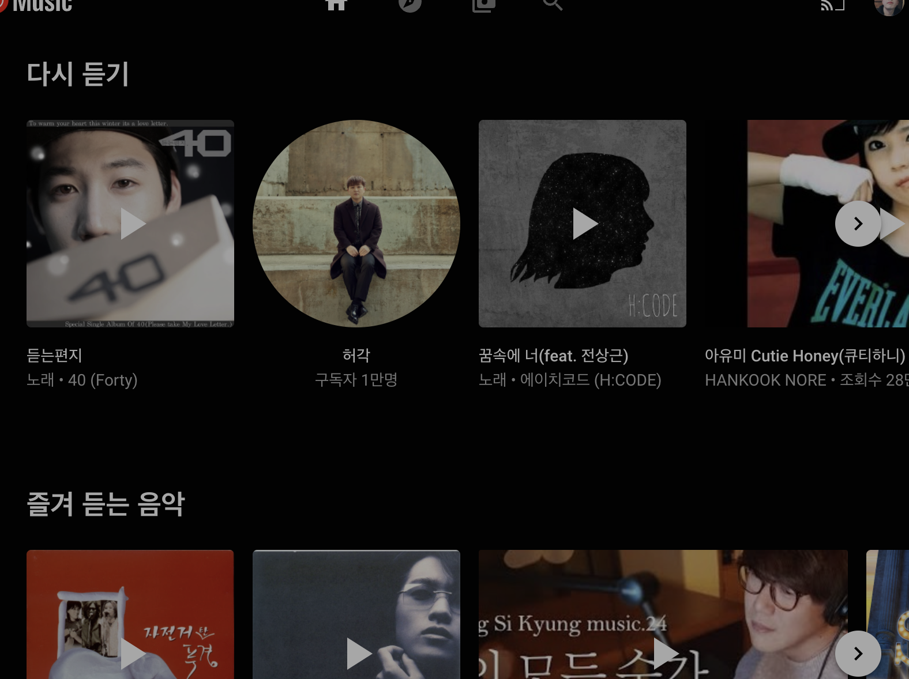

**[공지사항]** [renine94 깃허브](https://github.com/renine94)
{: .notice--danger}

<div class="notice--success">
  <h1> 안녕하다 </h1>
  <ul>
    <li> 공지1 </li>
    <li> 공지2 </li>
    <li> 공지3 </li>
  </ul>
</div>

[Google](https://www.google.com){: .btn .btn--danger}




# 블로그 다시 시작!


길고 긴 방황 끝에 블로그를 다시 시작합니다.

티스토리, 벨로그, 등 떠돌아다니다 깃허브로 정착하려고 합니다.

양질의 포스팅을 하려고 노력하겠습니다!

하이?




어우 이제야 이미지 들어가네 ㅅㅂ


```python
class User(Object):

  def __init__(self, value):
      self.value = value

user = user('hi')
user.value
```

# 목차2번째 생성

