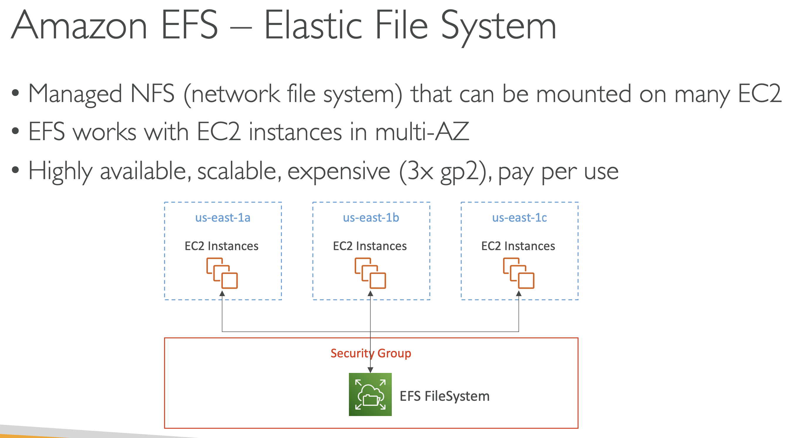
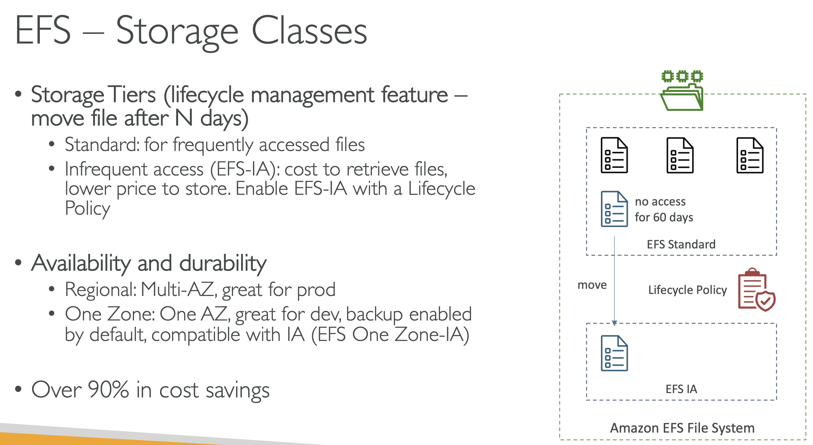
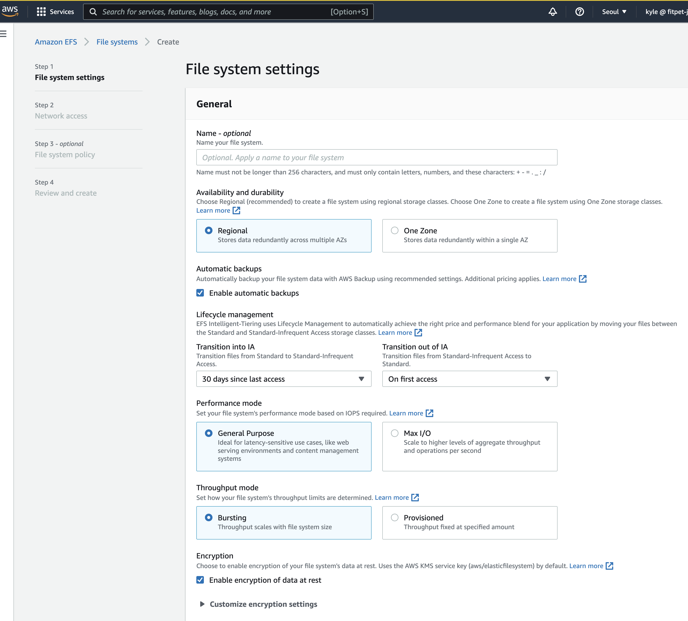
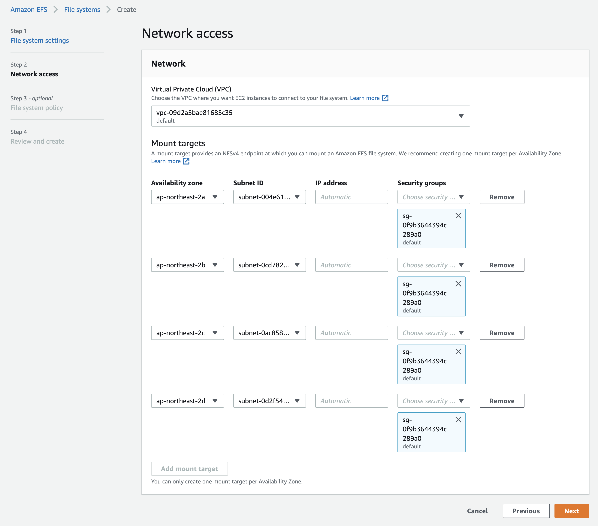
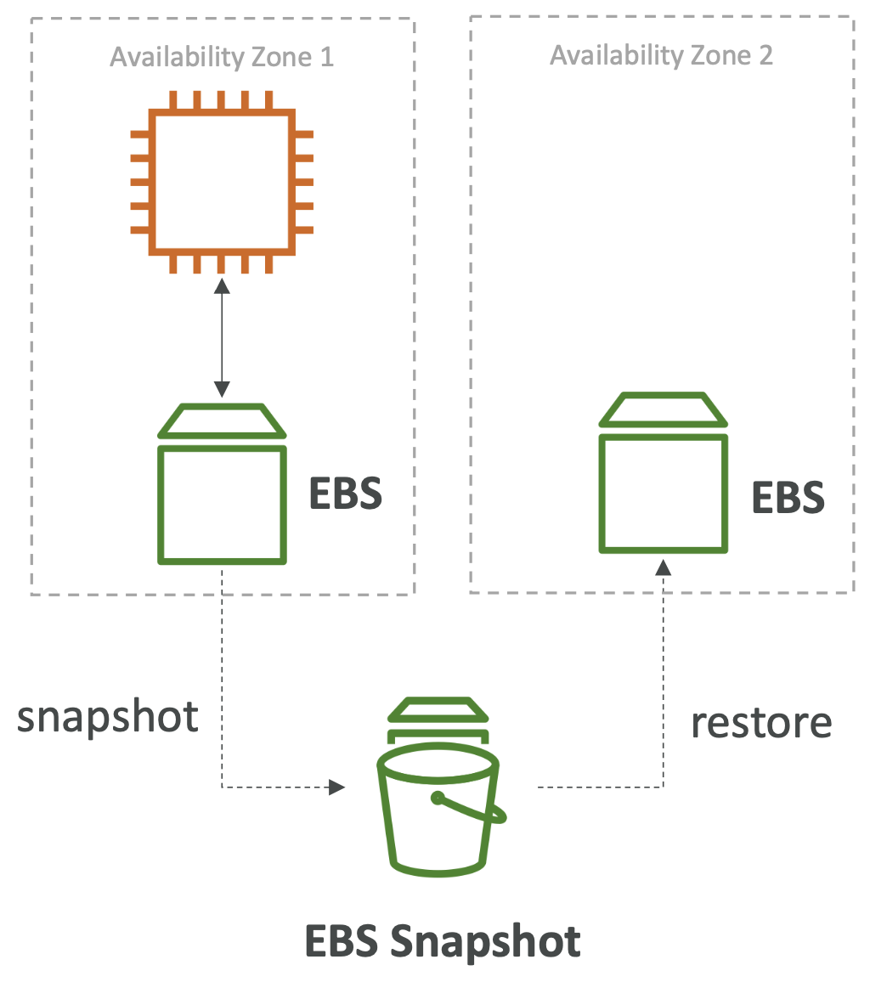
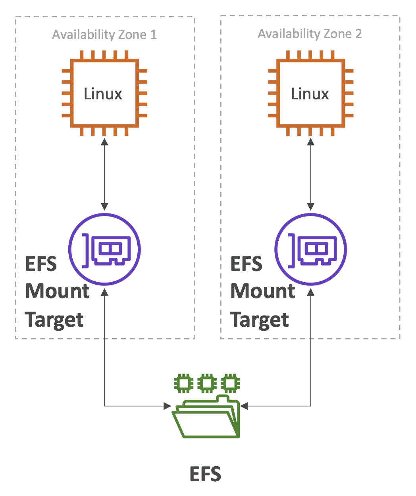

# 01. EFS 개요

Elastic File System 의 약자로 다양한 가용 영역에 걸쳐 다수의 EC2 인스턴스에 마운트 할 수 있는 관리형 NFS 혹은 네트워크 파일 시스템입니다. 즉, 다중 AZ에서 동작하며 이 점이 EFS와 EBS의 가장 큰 차이이다.
{: .notice--success}

**EBS**

- 단일 가용영역(AZ) 에 묶여 있다.
- 한번에 하나의 EC2 인스턴스에만 연결되어 있어, 데이터가 다중 EC2 인스턴스간 공유되지 않는다.

**EFS**

- 다중 가용 영역에 걸쳐서 마운트가 가능 (가용성이 높다.)
- 확장성도 높으며 비용도 많이 든다.
- gp2 드라이브에 비해서 비용이 약 3배에 달하지만 쓴 만큼만 내면 된다.
- 너무 많은 데이터를 저장하지 않는 경우 EBS 보다 EFS 가 더 저렴할 수도 있다.
- 네트워크 파일 시스템으로 EFS 드라이브의 모든 EC2 인스턴스가 동일한 파일에 대한 접근권한을 가진다.
- 콘텐츠 관리, 웹서비스, 데이터 공유 또는 WordPress 웹사이트에 쓰인다.
- 표준 NFSv4.1 프로토콜을 사용한다.
- **EFS 파일 시스템에 접근하려면 네트워크 보안 그룹(Security Group)을 사용해야 한다.**
- **Linux AMI 에서만 작동한다.**
- Window 인스턴스는 파일 시스템에 EFS를 마운트 할 수가 없다.
- KMS 키를 사용하여 EFS 유휴 시 암호화를 설정할 수 있다.
- POSIX 파일 시스템 즉, Linux에서만 사용가능하며 표준 파일 API를 갖는다.
- 자동으로 확장되며, 쓰는 만큼만 비용을 내는방식, 용량에 구애받지 않고 사용이 가능하다.
- 수천 명의 동시 클라이언트와 초당 최대 10GB의 처리량을 자랑한다. (성능이 아주 우수)
- 파일 시스템 자체가 페타바이트(PB) 정도까지 확장될수 있으므로 용량 관리 따로 필요없다. 자동수행된다.

- 성능모드
  - 범용 성능 모드 사용
    - 웹 서버 운영이나 콘텐츠관리, **지연 시간에 민감한 파일이 있는 경우** 
    - WordPress 운영할때 범용 EFS 파일 시스템 사용하는 것처럼
    - 여러 작은 파일에 신속히 접근해야 하는데, EFS가 바로 해당 경우를 위해 제작됨
    - Max I/O 성능 모드
      - 대규모 데이터 워크로드를 처리하는 경우
      - 지연시간은 더 길겠지만 처리량은 더 향상된다.
      - 병렬적으로, 빅데이터나 미디어처리에도 훌륭한 성능
  - 처리량 모드
    - 버스팅 / Provisioned 모드로 2가지로 나뉜다. (default. 버스팅 처리량 모드)
    - 1TB 스토리지에 대해 초당 50MB 를 저장할 수 있으며, 초당 100MB 까지 확장 가능
    - 파일시스템 크기에 따라 처리량이 증가하므로 EFS 파일 시스템의 크기는 줄이면서 처리량은 높이기 위해서는프로비저닝된 처리량 모드로 설정을 바꿀 수 있다.
    - 해당 모드에서는 스토리지 크기와 상관없이 처리량을 설정할 수 있다.
      - 1TB 스토리지라도 초당 1GB 처리량 요청할 수 있다.
      - **파일 시스템 자체는 작으나, 높은 처리량이 필요할때는 프로비저닝 된 처리량 모드로 변경**

 

## 스토리지 계층

> 파일에 대한 수명 주기 관리 기능 30일이 지난 후 새로운 계층으로 파일을 이동시키는 기능이다.

- 접근 빈도가 높은 파일에 대해 표준으로 설정되어 있다.
- EFS-IA 라고 부르며, 저비용의 빈도가 낮은 접근에 대한 티어가 있다.
  - 하지만, 해당 파일을 가져올 때마다 관련된 비용이 발생한다.
  - 30일동안 파일에 접근을 안하면, 접근빈도가 낮은 파일이라고 인식하여 EFS-IA 로 이동한다. (비용절감)

##  🚀 실습

- 여러 AZ에 걸쳐 작동이 가능
- 각 AZ에 대해 보안 그룹 정의 필요

- EFS 를 만든다.
- EC2 를 2개이상 만든다. (서로 다른 가용영역으로)
- EC2 에 `ssh -i key.pem ec2-user@ec2_ip` 로 접속한 뒤, amazon-efs-utils 패키지를 설치해줘야 한다.
  - `sudo yum install -y amazon-efs-utils`
- 각각의 EC2 인스턴스 콘솔창에서 `mkdir efs` 로 폴더를 만들어준다.
- `sudo mount -t efs -o tls fs-5dafeeac:/ efs` 명령어를 입력하여 efs 폴더에 마운트 시켜준다.
  - 타임초과가 발생 시 대처 방법
  - SG 을 수정한다.
  - my-efs-demo 가 ec2-to-efs 보안그룹으로부터 오는 트래픽을 허용하도록 설정해야 한다.
  - my-efs-demo
    - 인바운드 규칙을 수정한다.
    - NFS - TCP - 2049 
    - Source: ec2-to-efs 보안그룹으로 설정한다.

- ap-northest-2 의 AZ1 에 생성된 EC2 에 접속해서 efs폴더에 파일을 만들게 되면,
- ap-northest-2 의 AZ2 에 있는 EC2 에서도 efs폴더에 접근하면 파일이 생성되있는것을 볼 수 있다.
- 원드라이브, 구글드라이브, 네이버박스 처럼 그냥 클라우드 저장소 생기는거라 보면 될듯..?

# 02. EBS 와 EFS 비교

## 🚀 EBS

- 한 번에 하나의 인스턴스에만 연결 가능
- 특정 가용 영역에 한정
- EC2 인스턴스가 첫 번째 AZ에 연결됬고, EBS 볼륨도 실제로 해당 AZ 에 있다.
- EBS 볼륨 유형 
  - `gp2` 
    - 디스크 크기가 늘어나면 IO 도 함께 늘어난다.
  - `io1`
    - IO를 볼륨 크기와 관계없이 독립적으로 증가시킬 수 있다.
    - **한번에 여러대의 인스턴스에 연결할 수 있다.**
- EBS 를 다른 가용 영역으로 옮기고자 할 때는 스냅샷을 찍어야 한다.
- 다른 AZ 에서 스냅샷을 복원시켜야 해당 AZ 에 EBS 볼륨이 생성된다.
- EBS 의 스냅샷이나 백업을 만들 때에는 EBS 볼륨 내의 IO를 전부 사용 하게 되니, 인스턴스가 EBS를 사용 중이 아닐 때에만 실행해야 한다.
- EC2 인스턴스가 종료되면 인스턴스 내의 루트 EBS 볼륨도 기본적으로 종료된다.
  - 원할 경우 해당 동작을 비활성화 할 수 있다.
- EBS 는 실제 사용한 양이 아니라, 드라이브 크기에 따라 정해진 사용량을 지불하는 방식
- **네트워크 볼륨을 한 번에 하나의 인스턴스에 연결하고, 특정 AZ내로 한정된다.**

## 🚀 EFS

- Elastic File System
- 여러 개의 가용 영역에 걸쳐 무수히 많은 인스턴스들에 연결될 수 있다.
- Linux AMI 에서 생성 가능하다.
- **EFS 들은 다중 AZ 이기 때문에 AZ 외부에 존재한다.**
- EFS Mount Target 을 사용해 특정 AZ에서 EC2 인스턴스들과 EFS드라이브를 연결 해 줄 수 있다.
- Linux 인스턴스에서만 가능, POSIX 파일시스템이라 Window에서 구동되지 않는다.
- **EFS 는 EBS 보다 훨씬 비싸다.** (약 3배)
- **비용절감을 원하면 EFS-IA 을 사용하고, 제품 수명 정책을 사용하면된다. (30일)**
- **EFS 는 사용한 만큼만 비용이 청구된다.**
- 다수의 인스턴스에 걸쳐 연결해야 하는 네트워크 파일 시스템에 적합하다.

## 🚀 Instance Store

- 인스턴스 스토어는 EC2 인스턴스의 IO를 최대로 사용하게끔 해주지만 인스턴스가 망가지면 함께 망가지는 임시 드라이브이다.