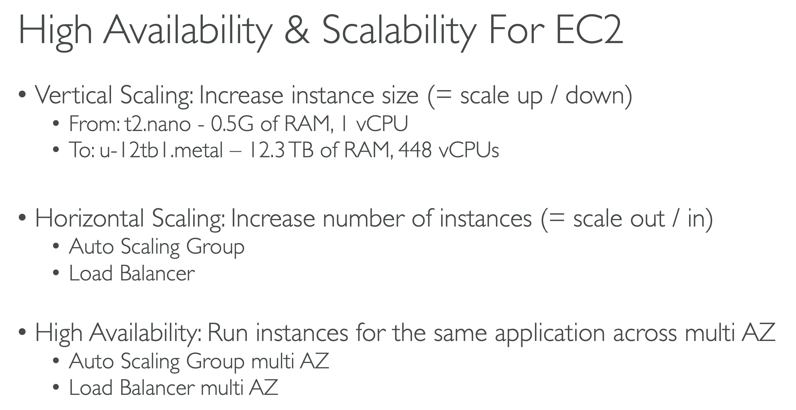

# 🚀 고가용성 및 스케일링성

## 01. Scalability & High Availability

>  확장성(스케일링) 이란 애플리케이션 시스템이 조정을 통해 더 많은 양을 처리할 수 있다는 의미이다.
>
> 확장성과 고가용성은 연관된 개념이지만 서로 다른 개념이다.

### 스케일링 (Scalability)

- 스케일링 종류
  - **수직 확장 (Vertical)**
    - 인스턴스의 크기를 확장하는 것
    - 하드웨어의 성능 & 용량을 물리적으로 늘리는 방법이다.
    - EC2 `t2.micro => t2.2xlarge`
    - 데이터베이스와 같이 분산되지 않은 시스템에서 흔히 사용된다.
      - RDS, Redis 등과 같은 데이터베이스
  - **수평 확장 (Horizontal)**
    - 탄력성이라고 불리기도 한다.
    - 애플리케이션에서 인스턴스나 시스템의 수를 늘리는 방법
      - **Auto Scaling Group (ASG)**
      - **Load Balancer**
    - EC2 1대에서 처리하던것을 N대로 갯수를 늘린다.
    - 분배 시스템이 있다는 의미
    - 클라우드 제공 업체 덕분에 수평적인 확장이 더욱 수월해졌다.
      - 순식간에 EC2 개수를 늘릴 수 있기 때문이다.

### 고가용성 (High Availability)

보통 수평 확장과 함께 사용되는 개념이지만 늘 그렇지는 않다. 고가용성이란 애플리케이션 또는 시스템을 적어도 둘 이상의 AWS의 AZ나 데이터 센터에서 가동 중이라는걸 의미

고가용성의 목표는 **데이터 손실에서 살아남는것** 이다. 센터 하나가 멈춰도 계속 작동이 가능하게끔 하는 것

ap-northest-2 의 ap-northest-2a 가용영역(AZ) 에 3대의 인스턴스가 있고, ap-northest-2b 에 3대의 인스턴스가 있다고 가정하면, 2a 가용영역에 문제가 생겨도 2b 가용영역에서는 정상적으로 동작하기 때문에 이런 경우 가용성이 높다라고 할 수 있다.
{: .notice--info}

- 동일 애플리케이션의 동일 인스턴스를 다수의 AZ에 걸쳐 실행하는 경우를 의미한다.
- **다중 AZ가 활성화된 오토 스케일링 그룹(ASG)이나 로드 밸런서에도 사용된다.**

### 용어

- **Scale Up**
  - 인스턴스의 크기(성능 용량) 을 늘리는 것
- Scale Down
  - 인스턴스의 크기(성능 용량) 을 낮추는 것
- **Scale Out**
  - 인스턴스의 수가 늘어나는 것
- Scale In
  - 인스턴스의 수가 줄어드는 것

### 정리

- 수직 확장
  - 스케일 업/다운
  - 물리적으로 하드웨어 용량 늘림
- 수평 확장
  - 스케일 아웃/인
  - 인스턴스 수를 늘림
- 고가용성
  - 같은 애플리케이션을 여러 AZ 에서 실행
  - 데이터 손실 방지 목적