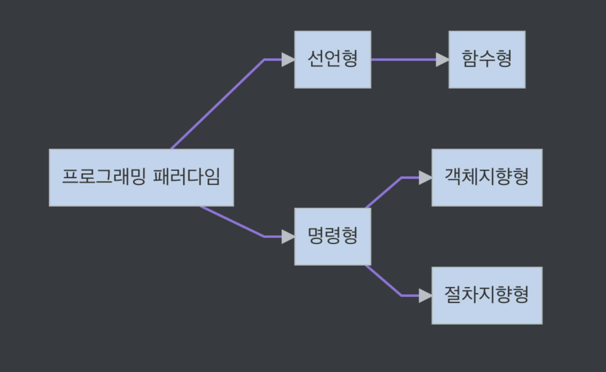

**[알림]** 책에 대한 정보는 [여기](https://www.aladin.co.kr/shop/wproduct.aspx?ItemId=292815727) 를 참고해주세요.🚀🚀
{: .notice--danger}


# 01. 프로그래밍 패러다임

<div class="notice--success">
  <ul>
    <li> 프로그래머에게 프로그래밍의 관점을 갖게 해주는 역할을 하는 개발 방법론 </li>
  </ul>
</div>

- **객체지향 프로그래밍**
  - 프로그래머들이 프로그램을 상호 작용하는 객체들의 집합으로 볼 수 있게함
- **함수형 프로그래밍**
  - 상태 값을 지니지 않는 함수 값들의 연속으로 생각할 수 있게 해준다.

<br>

어떤 언어는 특정 패러다임을 지원하기도 하는데, `jdk 1.8` 이전의 자바는 객체지향프로그래밍을 지원하는 반면에 <br> `하스켈` 은 함수형 프로그래밍을 지원합니다.  여러 패러다임을 지원하는 언어로는 C++, Python, Javascript 가 있으며, <br> 자바의 경우 `jdk 1.8` 부터 함수형 프로그래밍 패러다임을 지원하기 위해 람다식, 생성자 레퍼런스, 메서드 레퍼런스 를 도입했고 선언형 프로그래밍을 위해 스트림(Stream) 같은 표준 API 등도 추가했다.


프로그래밍 패러다임은 크게 `선언형, 명령형` 으로 나누며, <br> 선언형은 함수형이라는 하위 집합을 갖습니다. 또한 명령형은 다시 객체지향, 절차지향으로 나눕니다.




## 1. 선언형과 함수형 프로그래밍

> 선언형(declarative programming) 이란, '무엇을' 풀어내는가에 집중하는 패러다임
>
> 프로그램은 함수로 이루어진 것이다. 라는 명제가 담겨있는 패러다임이기도 하다.
>
> **함수형 프로그래밍은 선언형 패러다임의 일종입니다.**


함수형 프로그래밍

ex) 자연수로 이루어진 배열에서 최대값을 찾으라고 한다면 다음과 같이 로직을 구성한다.

```js
const ret = [1,2,3,4,5,11,12].reduce((max, num) => num > max ? num : max, 0)
console.log(ret) // 12
```

앞의 코드에서 `reduce()` 는 '배열' 만 받아서 누적한 결과값을 반환하는 순수 함수이다.


함수형 프로그래밍은 이와 같은 작은 '순수 함수'들을 블록처럼 쌓아 로직을 구현하고<br> '고차 함수'를 통해 재사용성을 높인 프로그래밍 패러다임입니다. 자바스크립트는 단순하고 유연한 언어이며,<br> 함수가 일급 객체이기 때문에 객체지향 프로그래밍보다는 함수형 프로그래밍 방식이 선호됩니다.


**순수 함수**

출력이 입력에만 의존하는 것을 의미합니다.

```js
const pure = (a, b) => {
  return a + b
}
```

`pure()` 함수는 들어오는 매개변수 a, b에만 영향을 받습니다.<br> 만약 a, b 말고 다른 전역 변수 c등이 이 출력에 영향을 주면 순수 함수가 아닙니다.


**고차 함수**

고차 함수란 함수가 함수를 값처럼 매개변수로 받아 로직을 생성할 수 있는 것을 말한다.


*<u>일급 객체</u>*

고차 함수를 쓰기 위해서는 해당 언어가 일급 객체라는 특징을 가져야 하며, 그 특징은 다음과 같다.

- 변수나 메서드에 함수를 할당할 수 있다.
- 함수 안에 함수를 매개변수로 담을 수 있다.
- 함수가 함수를 반환할 수 있다.


## 2. 객체지향 프로그래밍

> - OOP 는 객체들의 집합으로 프로그램의 상호 작용을 표현
> - 데이터를 객체로 취급하여 객체 내부에 선언된 메서드를 활용하는 방식
> - 설계에 많은 시간이 소요되며, 처리속도가 다른 프로그래밍 패러다임에 비해 상대적으로 느림

Ex) 자연수로 이루어진 배열에서 최대값을 찾는 로직

```js
const ret = [1, 2, 3, 4, 5, 11, 12]

class List {
  constructor(list) {
    this.list = list
    this.max = list.reduce((max, num) => num > max ? num : max, 0)
  }
  getMax() {
    return this.max
  }
}

const a = new List(ret)
console.log(a.getMax()) // 12
```

`List` 라는 클래스를 만들고 a라는 객체를 만들 때 최대값을 추출해내는 메서드를 만든 예제입니다.


### OOP 특징

- 추상화, 캡슐화, 상속성, 다형성

**추상화**

- 복잡한 시스템으로부터 핵심적인 개념 또는 기능을 간추려내는 것을 의미

**캡슐화**

- Encapsulation은 객체의 속성과 메서드를 하나로 묶고 일부를 외부에 감추어 은닉하는 것

**상속성**

- Inheritance은 상위 클래스의 특성을 하위 클래스가 이어받아서 재사용하거나 추가, 확장하는 것
- 코드의 재사용 측면, 계층적 관계의 생성, 유지 보수성 측면에서 중요

**다형성**

- Polymorphism은 하나의 메서드나 클래스가 다양한 방법으로 동작하는 것을 말합니다.
- 대표적으로 `오버로딩`, `오버라이딩` 이 있다.


### OOP 설계원칙

객체지향 프로그래밍을 설계할 때는 SOLID 원칙을 지켜주어야 한다.

S - 단일 책임 원칙

O - 개방-폐쇄 원칙

L - 리스코프 치환 원칙

I - 인터페이스 분리 원칙

D - 의존역전 원칙


**단일책임 원칙**

- 단일 책임 원칙(Single Responsibility Principle) 은 모든 클래스는 각각 하나의 책임만 가져야하는 원칙
- A 라는 로직이 존재한다면 어떠한 클래스는 A에 관한 클래스여야 하고 이를 수정한다고 해도 A와 관련된 수정이어야 한다.

**개방-폐쇄 원칙**

- Open Closed Principle은 유지보수 사항이 생긴다면 코드를 쉽게 확장할 수 있도록 하고 수정할 때는 닫혀있어야 하는 원칙
- 기존의 코드는 잘 변경하지 않으면서도 확장은 쉽게 할 수 있어야 한다.

**리스코프 치환 원칙**

- Liskov Substitution Principle은 프로그램의 객체는 프로그램의 정확성을 깨뜨리지 않으면서 하위 타입의 인스턴스로 바꿀 수 있어야 한다는 것을 의미한다.
- 클래스는 상속이 되기 마련이고, 부모 자식이라는 계층관계가 만들어진다.
- 부모 객체에 자식 객체를 넣어도 시스템이 문제없이 돌아가게 만드는 것을 말한다.

**인터페이스 분리 원칙**

- (Interface Segregation Principle)은 하나의 일반적인 인터페이스보다 구체적인 여러 개의 인터페이스를 만들어야 하는 원칙을 말합니다.

**의존 역전 원칙**

- Dependency Inversion Principle 은 자신보다 변하기 쉬운 것에 의존 하던것을 추상화된 인터페이스나 상위 클래스를 두어 변하기 쉬운 것의 변화에 영향받지 않게 하는 원칙을 말한다.
- 예를 들어 타이어를 갈아끼울 수 있는 틀을 만들어 놓은 후, 다양한 타이어를 교체할 수 있어야 한다.
- 즉 **상위 계층은 하위 계층에 변화에 대한 구현으로부터 독립해야 한다.**


## 3. 절차형 프로그래밍

> - 로직이 수행되어야 할 연속적인 계산 과정으로 이루어져 있다.
> - 일이 진행되는 방식으로 그저 코드를 구현하기만 하면 되기 때문에<br> 코드의 가족성이 좋으며 실행속도가 빠르다.
> - 계산이 많은 작업 등에 쓰인다.
> - 포트란을 이용한 대기과학 관련 연산작업, 머신 러닝의 배치 작업이 있다.
> - 단점으로는 모듈화하기가 어렵고, 유지 보수성이 떨어진다.


## 4. 패러다임의 혼합

어떠한 패러다임이 가장 좋을까요? => 정답이 없다.


비즈니스 로직이나 서비스의 특징을 고려해서 패러다임을 정하는 것이 좋다.

하나의 패러다임을 기반으로 통일하여 서비스를 구축하는 것도 좋은 생각이지만, 여러 패러다임을 조합하여 상황과 맥락에 따라 패러다임 간의 장점만 취해 개발하는 것이 좋다.


예를들어

- 백엔드에 머신러닝 파이프라인과 거래 관련 로직이 있다면
  - 머신러닝 파이프라인 - 절차지향적 패러다임
  - 거래관련 로직 - 함수형 프로그래밍

을 적용하는 것이 좋다.
