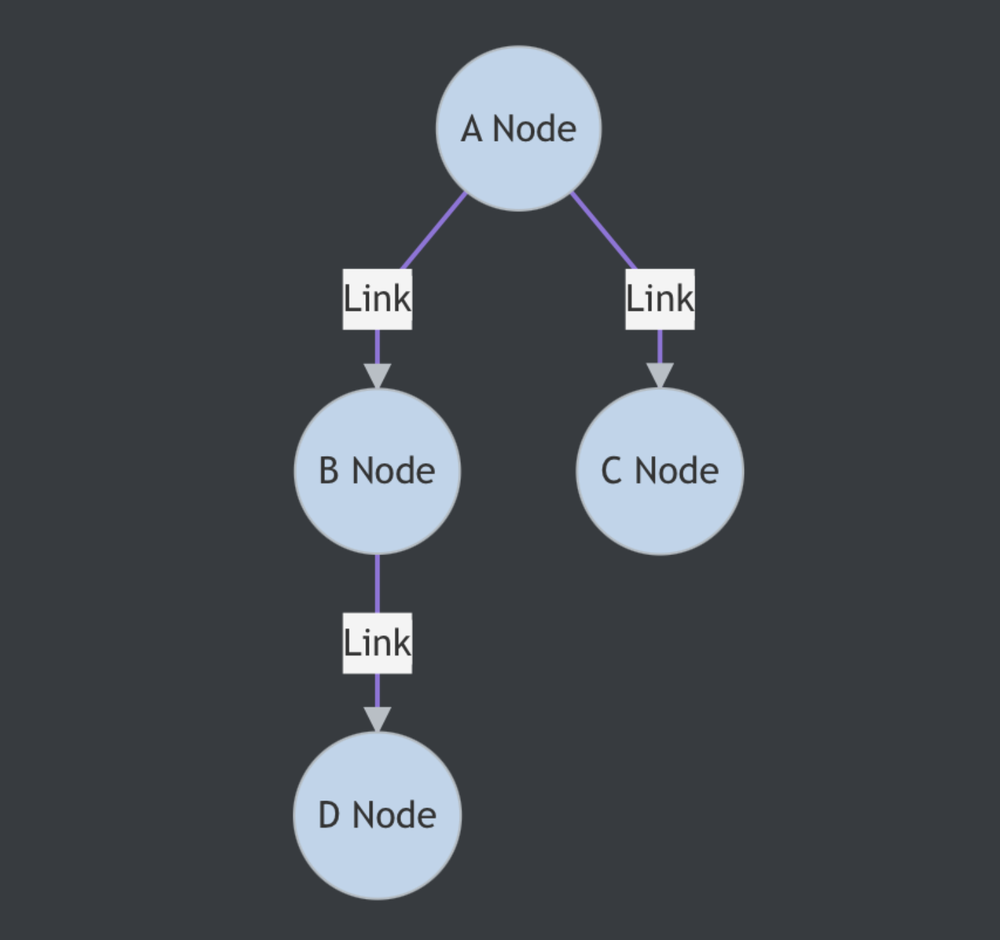

**[알림]** 책에 대한 정보는 [여기](https://www.aladin.co.kr/shop/wproduct.aspx?ItemId=292815727) 를 참고해주세요.🚀🚀
{: .notice--danger}

**네트워크** 네트워크는 컴퓨터 등의 장치들이 통신 기술을 이용하여 구축하는 연결망을 지칭하는 용어이다. 네트워크의 기초부터 시작해서 네트워크를 이루는 계층, 장치 등에 대해 알아보자.
{: .notice--success}

# 01. 네트워크의 기초

네트워크란 노드(node)와 링크(link)가 서로 연결되어 있거나 연결되어 있지 않은 집합을 의미  (알고리즘 그래프 이론과 비슷)

- 노드란 `서버, 라우터, 스위치` 등 네트워크 장비를 의미
- 링크는 유선 또는 무선을 의미

## 🚀 처리량과 지연 시간

- 네트워크를 구축할 때는 '좋은' 네트워크로 만드는 것이 중요하다.
- 좋은 네트워크란 많은 처리량을 처리할 수 있으며, 지연 시간이 짧고, 장애빈도가 적으며, 좋은 보안을 갖춘 네트워크이다.

**처리량(Throughput)**

- 링크를 통해 전달되는 단위 시간당 데이터양
- 단위는 bps (bits per second) 초당 전송 또는 수신되는 비트 수
- 사용자들이 많이 접속할 때마다 커지는 트래픽, 네트워크 장치 간의 대역폭 네트워크 중간에 발생하는 에러, 장치의 하드웨어 스펙에 영향을 받는다.
- 대역폭
  - 주어진 시간 동안 네트워크 연결을 통해 흐를 수 있는 최대 비트 수

**지연 시간(Latency)**

- 요청이 처리되는 시간
- 어떤 메시지가 두 장치 사이의 왕복하는데 걸린 시간
- 매체 타입(무선, 유선), 패킷 크기, 라우터의 패킷 처리 시간에 영향을 받는다.

## 🚀 네트워크 토폴로지와 병목 현상

**네트워크 토폴로지**

네트워크를 설계할 때 고려하는 네트워크 토폴로지를 알아보겠습니다. 네트워크 토폴로지(Network topology)는 노드와 링크가 어떻게 배치되어 있는지에 대한 방식이자 연결 형태를 의미

<small>트리 토폴로지</small>

- 트리 토폴로지는 계층형 토폴로지라고 하며, 트리 형태로 배치한 네트워크 구성을 말합니다.
- 노드의 추가, 삭제가 쉬우며 특정 노드에 트래픽이 집중될 때 하위 노드에 영향을 끼칠 수 있습니다.

<small>버스 토폴로지</small>

- 버스 토폴리지는 중앙 통신 회선 하나에 여러 개의 노드가 연결되어 공유하는 네트워크 구성을 말하며 근거리 통신망(LAN)에서 사용합니다.
- 설치 비용이 적고 신뢰성 우수
- 중앙 통신 회선에 노드를 추가하거나 삭제하기 쉽다.
- 스푸핑이 가능한 문제점이 있다.

<small>스타 토폴로지</small>

- 중앙에 있는 노드에 모두 연결된 네트워크 구성을 지칭
- 노드를 추가하거나 에러 탐지 쉽고, 패킷 충돌 가능성 적다.
- 어떤 노드에 장애가 발생해도 쉽게 에러 발견 가능
- 장애 노드가 중앙 노드가 아닐 경우 다른 노드에 영향 끼치는 것이 적다.
- 중앙 노드에 장애가 발생하면 전체 네트워크를 사용할 수 없고, 설치비용이 비싸다.

<small>링형 토폴로지</small>

- 각각의 노드가 양 옆의 두 노드와 연결하여 전체적으로 고리처럼 하나의 연속된 길을 통해 통신을 하는 망 구성방식
- 데이터는 노드에서 노드로 이동하게 되며, 각각의 노드는 고리모양의 길을 통해 패킷 처리
- 노드 증가되어도, 네트워크상 손실이 거의 없고, 충돌 발생 가능성 적고, 노드 고장 쉽게 발견 가능

<small>메시 토폴로지</small>

- 망형 토폴로지라고도 하며, 그물망처럼 연결되어 있는 구조
- 한 단말 장치에 장애가 발생해도 여러 개의 경로가 존재하므로, 네트워크를 계속 사용할 수 있고
- 트래픽도 분산처리가 가능하다.
- 노드의 추가가 어렵고, 구축 비용과 운영 비용이 고가인 단점

**병목 현상**

네트워크 구조라고도 일컫는 토폴로지가 중요한 이유는 병목 현상을 찾을 때 중요한 기준이 되기 때문

- 병목 현상은 전체 시스템의 성능이나 용량이 하나의 구성요소로 인해 제한받는 현상
- 예를 들어 병의 몸통보다 병의 목 부분 내부 지름이 좁아서 물이 상대적으로 천천히 쏟아지는 것에 비유
- 서비스에서 이벤트를 열었을 때, 트래픽이 많이 생기고 그 트래픽을 잘 관리하지 못하면 병목 현상이 생겨 사용자는 웹 사이트로 들어가지 못한다.

## 🚀 네트워크 분류

규모를 기반으로 분류할 수 있다.

- LAN
  - 사무실과 개인적으로 소유 가능한 규모
  - 근거리 통신망, 같은 건물이나 캠퍼스 같은 좁은 공간에서 운영
  - 전송 속도가 빠르고 혼잡하지 않다.
- MAN
  - 서울 시 등 시 정도의 규모
  - 대도시 지역 네트워크를 나타내며, 도시 같은 넓은 지역에서 운영
  - 전송 속도는 평균이며 LAN 보다 더 혼잡
- WAN
  - 세계 규모의 네트워크
  - 광역 네트워크, 국가 또는 대륙 같은 더 넓은 지역
  - 전송 속도 낮으며, MAN 보다 더 혼잡

## 🚀 네트워크 성능 분석 명령어

네트워크 병목현상 주된 원인

- 네트워크 대역폭
- 네트워크 토폴로지
- 서버 CPU, 메모리 사용량
- 비효율적인 네트워크 구성

네트워크 관련 테스트, 네트워크 무관련 테스트를 통해 네트워크 문제라면 성능 분석을 해야한다.

사용하는 명령어

- ping (packet INternet Groper)
  - 네트워크 상태를 확인하려는 대상 노드를 향해 일정 크기의 패킷을 전송하는 명령
  - 해당 노드의 패킷 수신 상태와 도달하기까지의 시간 알 수 있다.
  - 해당 노드까지 잘 연결되어 있는지 확인 가능
  - TCP/IP 프로토콜중에 ICMP 프로토콜을 통해 동작
  - `ping www.google.com`
- netstat
  - 접속되어 있는 서비스들의 네트워크 상태를 표시하는데 사용
  - 네트워크 접속, 라우팅 테이블, 네트워크 프로토콜 등 리스트를 보여줌
  - 서비스의 포트가 열려 있는지 확인할때 사용
- nslookup
  - DNS에 관련된 내용을 확인하기 위해 쓰는 명령
  - **특정 도메인에 매핑된 IP를 확인하기위해 사용된다.**
- tracert
  - 윈도우에서 `tracert` , 리눅스에서 `traceroute`
  - 목적지 노드까지 네트워크 경로를 확인할 때 사용되는 명령어
  - **목적지 노드까지 구간들 중 어느 구간에서 응답이 느려지는지 확인 가능**

네트워크 분석 프로그램

- wireshark
- netmon

## 🚀 네트워크 프로토콜 표준화

> 네트워크 프로토콜이란 다른 장치들끼리 데이터를 주고받기 위해 설정된 공통된 인터페이스
>
> 프로토콜은 기업이나 개인이 발표해서 정하는것이 아니라 IEEE 또는 IETF 라는 표준화 단체가 정한다.

