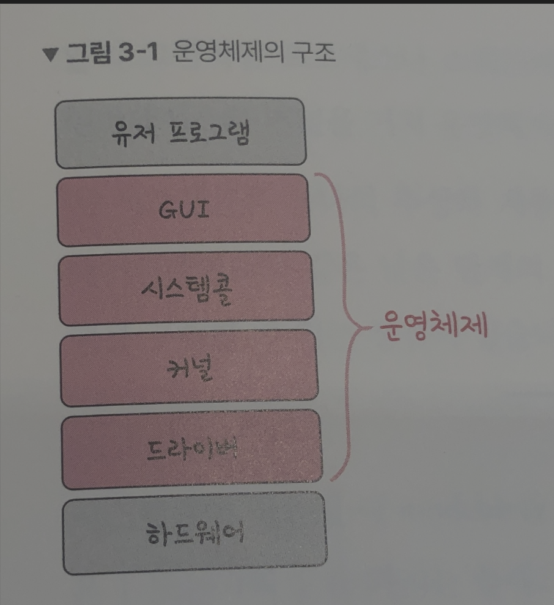
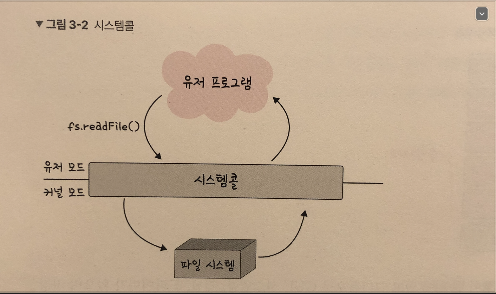
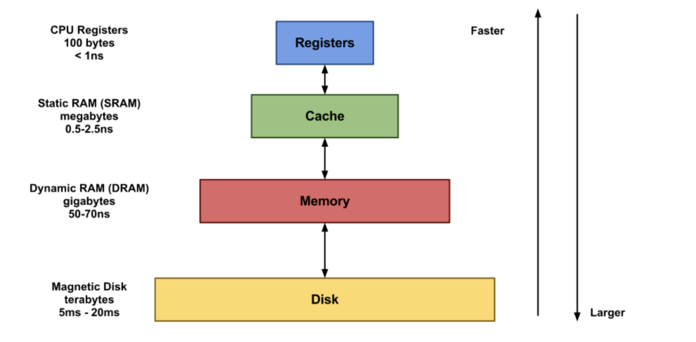

# 01. 운영체제와 컴퓨터
하드웨어와 소프트웨어(유저 프로그램)를 관리하는 일꾼인 운영체재(OS) 와 CPU, Memory 등으로 이루어진 컴퓨터를 알아보자
{: .notice--success}

**운영체제의 역할**
- CPU 스케줄링과 프로세스 관리
  - CPU 소유권을 어떤 프로세스에 할당할지, 프로세스의 생성과 삭제, 자원 할당 및 반환을 관리
- 메모리 관리
  - 한정된 메모리를 어떤 프로세스에 얼만큼 할당해야 하는지 관리
- 디스크 파일 관리
  - 디스크 파일을 어떠한 방법으로 보관할지 관리합니다.
- I/O 디바이스 관리
  - 마우스, 키보드와 컴퓨터 간에 데이터를 주고받는 것을 관리합니다.

**운영체제의 구조**

  <h1> 용어정리 </h1>
  <ul>
    <li> GUI </li>
    사용자가 전자장치와 상호 작용할 수 있도록 하는 사용자 인터페이스의 한 형태, 마우스로 클릭하는 단순한 동작으로 
    컴퓨터와 상호 작용 할 수 있도록 해준다.
       
    <li> 드라이버 </li>
    하드웨어를 제어하기 위한 소프트웨어
  </ul>

**시스템콜**

- 운영체제가 커널에 접근하기 위한 인터페이스
- 유저 프로그램이 운영체제의 서비스를 받기 위해 커널 함수를 호출할 때 쓴다.

유저 프로그램이 I/O 요청으로 트랩을 발동하면 올바른 I/O 요청인지 확인한 후 유저모드가 시스템콜을 통해 커널모드로 변환되어 실행된다. 예를들어 I/O 요청인 `fs.readline()` 이라는 파일 시스템의 파일을 읽는 함수가 발동했다고 하면,

유저모드에서 파일을 읽지 않고 커널모드로 들어가 파일을 읽고 다시 유저모드로 돌아가 그 뒤에 있는 유저 프로그램의 로직을 수행하게 된다. 이 과정을 통해 컴퓨터 자원에 대한 직접 접근을 차단할 수 있고, 다른 프로그램으로부터 보호할 수 있습니다.

  <h1> 용어정리 </h1>
  <ul>
    <li> 유저모드 </li>
    유저가 접근할 수 있는 영역을 제한적으로 두며 컴퓨터 자원에 함부로 침범하지 못하는 모드
       
    <li> 커널모드 </li>
    모든 컴퓨터 자원에 접근할 수 있는 모드
       
    <li> 커널 </li>
    운영체제의 핵심 부분이자 시스템콜 인터페이스를 제공하며 보안, 메모리, 프로세스, 파일 시스템, I/O 디바이스 
    I/O 요청 관리 등 운영체제의 중추적인 역할을 한다.
  </ul>

   

# 02. 컴퓨터의 요소

컴퓨터는 CPU, DMA 컨트롤러, 메모리, 타이머, 디바이스, 컨트롤러 등으로 이루어져 있습니다.

- CPU (Central Processing Unit)

산술논리연산장치, 제어장치, 레지스터로 구성되어 있는 컴퓨터 장치를 말하며, 인터럽트에 의해 단순히 메모리에 존재하는 명령어를 해석해서 실행하는 일꾼입니다.

관리자 역할을 하는 **OS의 커널이 프로그램을 메모리에 올려 프로세스로 만들면 일꾼인 CPU가 이를 처리**한다.

- 제어장치

제어장치(CU, Control Unit) 는 프로세스 조작을 지시하는 CPU의 한 부품입니다. 입출력장치 간 통신을 제어하고 명령어들을 읽고 해석하며 데이터 처리를 위한 순서를 결정합니다.

- 레지스터

레지스터는 CPU 안에 있는 매우 빠른 임시기억장치를 말합니다. CPU 와 직접 연결되어 있으므로 연산 속도가 메모리보다 수십 배에서 수백 배까지 빠릅니다. CPU는 자체적으로 데이터를 저장할 방법이 없기 때문에 레지스터를 거쳐 데이터를 전달합니다.

[레지스터와 캐시 비교 - 확인하러 가기!](https://melonicedlatte.com/computer/2018/11/07/190754.html)

- 공통점
  - 어떤 명령어나 데이터를 저장해두는 공간
- 차이점
  - 캐시는 CPU 와 별도로 있는공간 - 메인메모리와 CPU 간의 속도차이 극복하기 위한 것
  - 레지스터는 CPU안에서 연산을 처리하기 위하여 데이터를 저장하는 공간

