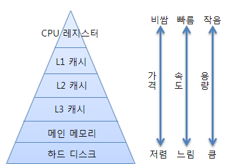
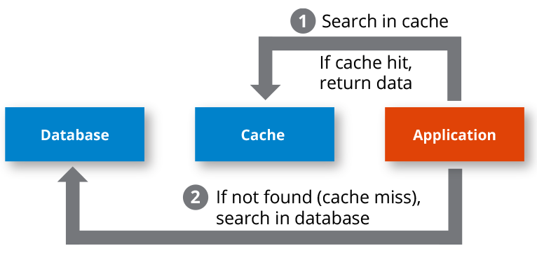
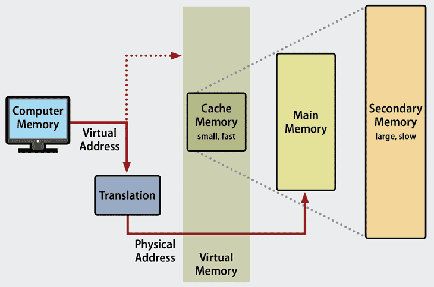
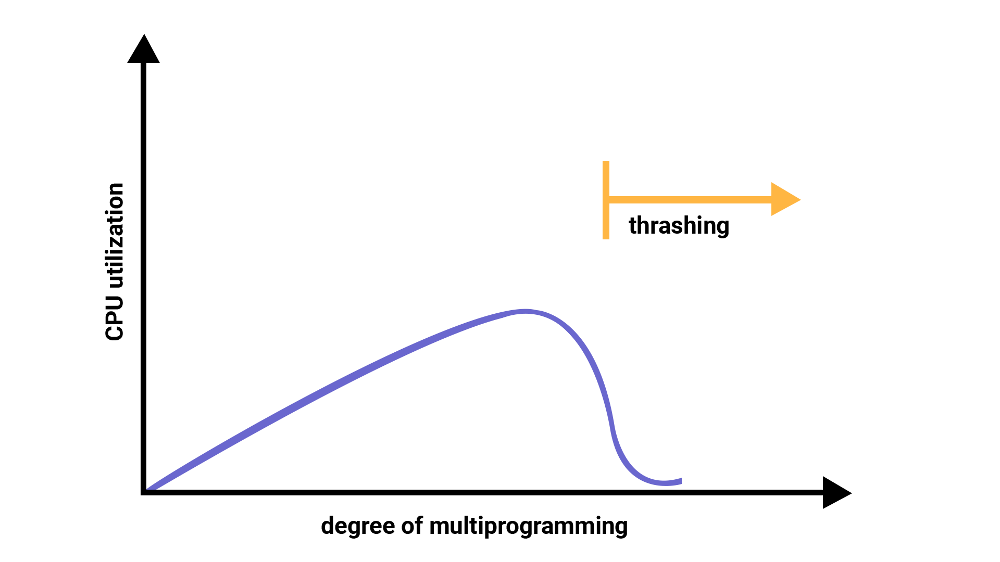

# Memory

> - CPU는 그저 '메모리'에 올라와 있는 프로그램의 명령어들을 실행한다.
> - 메모리 계층과 메모리 관리를 알아보자.


## 01. 메모리 계층

메모리 계층은 `레지스터, 캐시, 메모리, 저장장치` 로 구성되어 있다.




- **레지스터**: CPU안에 있는 작은 메모리, 휘발성, 속도 가장 빠름, 기억 용량이 가장 적다.
- **캐시**: L1, L2 캐시를 지칭한다. 휘발성, 속도 빠름, 기억 용량이 적습니다. 참고로 L3 캐시도 있다.
- **주기억장치**: RAM을 가리킨다. 휘방성, 속도 보통, 기억 용량이 보통이다.
- **보조기억장치**: HDD, SDD를 일컬으며 비휘발성, 속도 낮음, 기억 용량이 많다.


RAM은 HDD로부터 일정량의 데이터를 복사해서 임시 저장하고 이를 필요 시 마다 CPU에 빠르게 전달하는 역할을 합니다. 계층 위로 올라갈수록 가격은 비싸지는데, 용량은 작아지고 속도는 빨라지는 특징이 있다. 이러한 계층이 있는 이유는 경제성과 캐시때문입니다. 예를 들어 16GB RAM은 8만원 이면 삽니다. 하지만 16GB SSD는 훨씬 더 싼 가격에 살 수 있다. 이러한 경제성 때문에 계층을 두어 관리합니다.

이러한 계층 구조는 일상생활에서 경험할 수 있는데, 게임을 실행할 때마다 '로딩 중' 이라는 메시지가 나오는 것을 볼 수 있습니다. 이는 하드디스크 또는 인터넷에서 데이터를 읽어 RAM으로 전송하는 과정이 아직 끝나지 않음을 의미합니다.


### 캐시

캐시(cache)는 데이터를 미리 복사해 놓은 임시 저장소이자 빠른 장치와 느린 장치에서 속도 차이에 따른 병목 현상을 줄이기위한 메모리를 말합니다. 이를 통해 데이터를 접근하는 시간이 오래 걸리는 경우를 해결하고 무언가를 다시 계산하는 시간을 절약할 수 있습니다.

실제로 메모리와 CPU사이의 속도 차이가 너무 크기 때문에 그 중간에 레지스터 계층을 둬서 속도 차이를 해결합니다. 이렇게 속도 차이를 해결하기 위해 계층과 계층 사이에 있는 계층을 캐시 계층이라고 합니다. 예를 들어 캐시 메모리와 보조기억장치 사이에 있는 주기억장치를 보조기억장치의 캐싱 계층이라고 할 수 있습니다. 즉 **RAM 을 HDD,SDD의 캐싱 계층이라고 할 수 있다.**


#### 지역성의 원리

그렇다면 캐시 계층을 두는 것 말고 캐시를 직접 설정할 때는 어떻게 해야 할까?

이는 자주 사용하는 데이터를 기반으로 설정해야 한다. 그렇다면 자주 사용하는 데이터에 대한 근거가 되는 것은 무엇일까? 바로 지역성입니다. 지역성은 시간 지역성과 공간 지역성으로 나뉩니다.

- 시간 지역성(temporal locality)

  - 시간 지역성은 최근 사용한 데이터에 다시 접근하려는 특성을 말합니다. 예를 들어 for반복문으로 이루어진 코드 안의 변수 i에 계속해서 접근이 이루어지겠죠? 여기서 데이터는 변수 i이고, 최근에 사용했기 때문에 계속 접근해서 +1 을 연이어 하는 것을 볼 수 있습니다.

  - ```javascript
    let arr = Array.from({length: 10}, () => 0);
    console.log(arr)
    
    for (let i=0; i<10; i+=1) {
      arr[i] = i;
    }
    console.log(arr)
    
    /* [0, 0, 0, 0, 0, 0, 0, 0, 0, 0] */
    /* [0, 1, 2, 3, 4, 5, 6, 7, 8, 9] */
    ```

- 공간 지역성(spatial locality)

  - 공간 지역성은 최근 접근한 데이터를 이루고 있는 공간이나 그 가까운 공간에 접근하는 특성을 말합니다. 앞의 코드에서 공간을 나타내는 배열 arr의 각 요소들에 i가 할당되며 해당 배열에 연속적으로 접근함을 알 수 있다.


#### 캐시히트와 캐시미스



캐시에서 원하는 데이터를 찾았다면 **캐시히트**라고 하며, 해당 데이터가 캐시에 없다면 주메모리로 가서 데이터를 찾아오는 것을 **캐시미스라고 합니다.**


#### 캐시매핑

캐시매핑이란 캐시가 히트되기 위해 매핑하는 방법을 말하며 CPU의 레지스터와 주 메모리(RAM) 간에 데이터를 주고받을 때를 기반으로 설명합니다. 레지스터는 주 메모리에 비하면 굉장히 작고 주 메모리는 굉장히 크기 때문에 작은 레지스터가 캐시 계층으로써 역할을 잘 해주려면 이 매핑을 어떻게 하느냐가 중요하다.


캐시매핑 분류

| 이름                                          |                             설명                             |
| :-------------------------------------------- | :----------------------------------------------------------: |
| 직접 매핑<br />(directed mapping)             | 메모리 1~100이 있고 캐시가 1~10이 있다면 1:1~10, 2: 1~20 ,,, 이런식으로 매핑하는것을 말합니다.<br />처리가 빠르지만 충돌 발생이 잦습니다. |
| 연관 매핑<br />(associative mapping)          | 순서를 일치시키지않고 관련 캐시와 메모리를 매핑합니다. 충돌이 적지만 모든 블록을 탐색해야 해서 속도가 느립니다. |
| 집적 연관 매핑<br />(set associative mapping) | 직접 매핑과 연관 매핑을 합쳐놓은 것입니다. 순서는 일치시키지만 집합을 둬서 저장하며 블록화 되어 있기 때문에 검색은 좀더 효율적입니다. 예를 들어 메모리가 1~100이 있고 캐시가 1~10이 있다면 캐시 1~5 에는 1~50의 데이터를 무작위로 저장시키는 것을 말합니다. |


### 웹 브라우저의 캐시

소프트웨어적인 대표적인 캐시로는 웹 브라우저의 작은 저장소 쿠키, 로컬 스토리지, 세션 스토리지가 있습니다. 이러한 것들은 보통 사용자의 커스텀한 정보나 인증 모듈 관련 사항들을 웹 브라우저에 저장해서 추후 서버에 요청할 때 자신을 나타내는 아이덴티티나 중복 요청 방지를 위해 쓰입니다.

- 쿠키
- 로컬 스토리지
- 세션 스토리지


#### 쿠키

- Cookies는 만료기한이 있는 key-value Store입니다.
- same site옵션을 strict로 설정하지 않았을 경우 다른 도메인에서 요청했을 때 자동 전송
- 4KB까지 데이터를 저장할 수 있고, 만료기한을 정할 수 있다.
- 쿠키를 설정할 때는 document.cookie로 쿠키를 볼 수 없게 httponly 옵션을 거는 것이 중요하다.
- 클라이언트 또는 서버에서 만료기한 등을 정할 수 있는데 보통 서버에서 만료기한을 정합니다.

#### 로컬 스토리지

- 만료기한이 없는 key-value Store 입니다.
- 10MB 까지 저장할 수 있다.
- 웹 브라우저를 닫아도 유지되고 도메인 단위로 저장, 생성 됩니다.
- HTML5 를 지원하지 않는 웹 브라우저에서는 사용할 수 없으며, 
- 클라이언트에서만 수정 가능합니다.

#### 세션 스토리지

- 만료기한이 없는 key-value Store 입니다.
- Tab 단위로 세션 스토리지를 생성한다.
- 탭을 닫을때 해당 데이터가 삭제됩니다.
- 5MB 까지 저장 가능
- HTML5 를 지원하지 않는 웹 브라우저에서는 사용할 수 없습니다.
- 클라이언트에서만 수정 가능합니다.


### 데이터베이스의 캐싱 계층

참고로 데이터베이스 시스템을 구축할 때도 메인 데이터베이스 위에 **레디스(redis) 데이터 베이스 계층을 '캐싱 계층'** 으로 둬서 성능을 향상시키기도 합니다.

.png)


## 02. 메모리 관리

운영체제의 대표적인 할 일 중 하나가 메모리 관리입니다. 컴퓨터 내의 한정된 메모리를 극한으로 활용해야 하는 것이다.


### 2-1. 가상 메모리

가상 메모리(virtual memory)는 메모리 관리 기법의 하나로 컴퓨터가 실제로 이용 가능한 메모리 자원을 추상화하여 이를 사용하는 사용자들에게 매우 큰 메모리로 보이게 만드는 것을 말합니다.




이때 가상적으로 주어진 주소를 가상 주소(logical address)라고 하며, 실제 메모리상에 있는 주소를 실제 주소(physical address)라고 합니다. 가상 주소는 메모리관리장치(MMU) 에 의해 실제 주소로 변환(Translation)되며, 이 덕분에 사용자는 실제 주소를 의식할 필요 없이 프로그램을 구축 할 수있게 됩니다.

가상 메모리는 가상 주소와 실제 주소가 매핑되어 있고 프로세스의 주소 정보가 들어 있는 '페이지 테이블'로 관리됩니다. 이때 속도 향상을 위해 TLB를 씁니다.

<div class="notice--danger">
  <h1> 용어정리 </h1>
  <ul>
    <li> TLB </li>
    메모리와 CPU 사이에 있는 주소 변환을 위한 캐시이다. 페이지 테이블에 있는 리스트를 보관하며 CPU가 페이지 테이블까지 가지 않도록 해 속도를 향상시킬 수 있는 캐시 계층이다.
    <br><br><br>
    <li> 페이지(page) </li>
    가상 메모리를 사용하는 최소 크기 단위
    <br><br><br>
    <li> 프레임(frame) </li>
    실제 메모리를 사용하는 최소 크기 단위
    <br><br><br>    
  </ul>
</div>


#### 스와핑

만약 가상 메모리에는 존재하지만 실제 메모리인 RAM에는 현재 없는 데이터나 코드에 접근할 경우 '페이지 폴트'가 발생합니다. 이를 방지하기 위해 **당장 사용하지 않는 영역을 하드디스크로 옮겨 필요할 때 다시 RAM으로 불러와 올리고, 사용하지 않으면 다시 하드디스크로 내림을 반복하여 RAM을 효과적으로 관리**하는 것을 스와핑(swapping)이라고 합니다.


#### 페이지 폴트

페이지 폴트(page fault)란 프로세스의 주소 공간에는 존재하지만, 지금 이 컴퓨터의 RAM에는 없는 데이터에 접근했을 경우에 발생합니다. 이때 운영체제는 다음 과정으로 해당 데이터를 메모리로 가져와서 마치 페이지 폴트가 전혀 발생하지 않은 것처럼 프로그램이 작동하게 해줍니다. 페이지 폴트와 그로 인한 스오핑은 다음 과정으로 이루어집니다.

1. CPU는 물리 메모리를 확인하여 해당 페이지가 없으면 트랩을 발생해서 운영체제에 알립니다.
2. 운영체제는 CPU의 동작을 잠시 멈춥니다.
3. 운영체제는 페이지 테이블을 확인하여 가상 메모리에 페이지가 존재하는지 확인하고, 없으면 프로세스를 중단하고 현재 물리 메모리에 비어있는 프레임이 있는지 찾습니다. 물리 메모리에도 없으면 스와핑이 발동됩니다.
4. 비어 있는 프레임에 해당 페이지를 로드하고, 페이지 테이블을 최신화 합니다.
5. 중단되었던 CPU를 다시 시작합니다.


### 2-2. 스레싱

**스레싱(thrashing)은 메모리의 페이지 폴트율이 높은 것을 의미**하며, 이는 컴퓨터의 심각한 성능 저하를 초래한다.




스레싱은 메모리에 너무 많은 프로세스가 동시에 올라가게 되면 스와핑이 많이 일어나서 발생하는 것이죠, 페이지 폴트가 일어나면 CPU 이용률이 낮아집니다. CPU 이용률이 낮아지게 되면 운영체제는 "CPU가 한가한가?" 라고 생각하여 가용성을 더 높이기 위해 더 많은 프로세스를 메모리에 올리게 됩니다. 이와 같은 악순환이 반복되며 스레싱이 일어나게 됩니다.

이를 해결하기 위한 방법으로는 메모리를 늘리거나 HDD를 사용한다면 HDD를 SDD로 바꾸는 방법이 있습니다. 이외에 운영체제에서 이를 해결할 수 있는 방법은 작업 세트와 PFF가 있습니다.


#### 작업 세트

작업 세트(Working set)는 프로세스의 과거 사용 이력인 지역성(locality)을 통해 결정된 페이지 집합을 만들어서 미리 메모리에 로드하는 것입니다. 미리 메모리에 로드하면 탐색에 드는 비용을 줄일 수 있고 스와핑 또한 줄일 수 있습니다.


#### PFF

PFF(Page Fault Frequency) 페이지 폴트 빈도를 조절하는 방법으로 상한선과 하한선을 만드는 방법입니다. 만약 상한선에 도달한다면 페이지를 늘리고 하한선에 도달한다면 페이지를 줄이는 것이다.


### 2-3. 메모리 할당

메모리에 프로그램을 할당할 때는 시작 메모리 위치, 메모리의 할당 크기를 기반으로 할당하는데, 연속할당과 불연속 할당으로 나뉜다.

- 연속 할당
- 불연속 할당


#### 2-3-1. 연속 할당(Contiguous Allocation)


연속 할당은 메모리에 '연속적으로' 공간을 할당하는것을 말합니다.

위의 그림처럼 f1, f2, f3 를 순차적으로 공간에 할당하는 것을 볼 수 있다. 이는 메모리를 미리 나누어 관리하는 고정 분할 방식과 매 시점 프로그램의 크기에 맞게 메모리를 분할하여 사용하는 가변 분할 방식이 있습니다.


##### 고정 분할 방식

고정 분할 방식은 메모리를 미리 나누어 관리하는 방식이며, 메모리가 미리 나뉘어 있기 때문에 융통성이 없습니다. 또한 내부 단편화가 발생합니다.


##### 가변 분할 방식

가변 분할 방식은 매 시점 프로그램의 크기에 맞게 동적으로 메모리를 나눠 사용합니다. 내부 단편화는 발생하지 않고 외부 단편화는 발생할 수 있습니다. 이는 최초적합(first fit), 최적적합(base fit), 최악적합(worst fit)이 있습니다.

- 가변 분할 방식 종류

| 이름     | 설명                                                        |
| -------- | ----------------------------------------------------------- |
| 최초적합 | 위쪽이나 아래쪽부터 시작해서 홀을 찾으면 바로 할당합니다.   |
| 최적적합 | 프로세스의 크기 이상인 공간 중 가장 작은 홀부터 할당합니다. |
| 최악적합 | 프로세스의 크기와 가장 많이 차이가 나는 홀에 할당합니다.    |


<div class="notice--success">
  <h1> 용어정리 </h1>
  <ul>
    <li> 내부 단편화 </li>
    메모리를 나눈 크기보다 프로그램이 작아서 들어가지 못하는 공간이 많이 발생하는 현상
    <br><br><br>
    <li> 외부 단편화 </li>
    메모리를 나눈 크기보다 프로그램이 커서 들어가지 못하는 공간이 많이 발생하는 현상, 예를 들어 100MB를 55MB, 45MB로 나누었지만 프로그램의 크기는 70MB 일 때 들어가지 못하는 것을 말한다.
    <br><br><br>
    <li> 홀(hole) </li>
    할당할 수 있는 비어 있는 메모리 공간이다.
    <br><br><br>    
  </ul>
</div>


#### 2-3-2. 불연속 할당

메모리를 연속적으로 할당하지 않는 불연속 할당은 현대 운영체제가 쓰는 방법으로 불연속 할당인 페이징 기법이 있습니다. 메모리를 동일한 크기의 페이지 보통(4KB) 로 나누고 프로그램마다 페이지 테이블을 두어 이를 통해 메모리에 프로그램을 할당하는 것이죠, 페이징 기법 말고도 세그멘테이션, 페이지드 세그멘테이션 이 있습니다.

- 페이징
- 세그멘테이션
- 페이지드 세그멘테이션


##### 페이징

페이징(paging)은 동일한 크기의 페이지 단위로 나누어 메모리의 서로 다른 위치에 프로세스를 할당합니다. 홀의 크기가 균일하지 않은 문제가 없어지지만 주소 변환이 복잡해집니다.


##### 세그멘테이션

세그멘테이션(segmentation)은 페이지 단위가 아닌 의미 단위인 세그먼트로 나누는 방식입니다. 프로세스는 코드, 데이터, 스택, 힙 등으로 이루어지는데, 코드와 데이터 등 이를 기반으로 나눌 수도 있으며 함수 단위로 나눌 수도 있음을 의미합니다. 공유와 보안 측면에서 좋으며 홀 크기가 균일하지 않은 문제가 발생합니다.


##### 페이지드 세그맨테이션

페이지드 세그멘테이션(paged segmentation)은 공유나 보안을 의미 단위의 세그먼트로 나누고, 물리적 메모리는 페이지로 나눈것을 말합니다.


#### 페이지 교체 알고리즘

메모리는 한정되어 있기 때문에 스와핑이 많이 일어납니다. 스와핑은 많이 일어나지 않도록 설계되어야 하며, 이는 페이지 교체 알고리즘을 기반으로 스와핑이 일어납니다.


##### 오프라인 알고리즘

오프라인 알고리즘은 먼 미래에 참조되는 페이지와 현재 할당하는 페이지를 바꾸는 알고리즘이며, 가장 좋은 방법입니다. 그러나 미래에 사용되는 프로세스를 우리가 알 수 있을까요? 알 수 없습니다.

즉, 사용할 수 없는 알고리즘이지만 다른 알고리즘과의 성능 비교에 대한 기준을 제공합니다.


##### FIFO

FIFO (First In First Out) 는 선입선출 즉, 가장 먼저 온 페이지를 교체 영역에 가장 먼저 놓는 방법을 의미합니다.


##### LRU

.png)

LRU(Latest Recentle Used) 는 참조가 가장 오래된 페이지를 바꿉니다. '오래된' 것을 파악하기 위해 각 페이지마다 계수기, 스택을 두어야 하는 문제점이 있습니다.


LRU 구현을 프로그래밍으로 구현할 때는 보통 두 개의 자료구조로 구현합니다. 바로 해시 테이블과 이중 연결 리스트입니다. 해시 테이블은 이중 연결 리스트에서 빠르게 찾을 수 있도록 쓰고, 이중 연결 리스트는 한정된 메모리를 나타냅니다.


##### NUR

LRU 에서 발전한 Not Used Recently 알고리즘이 있습니다.


##### LFU

LFU (Latest Frequently Used) 가장 참조 횟수가 적은 페이지를 교체합니다. 즉, 많이 사용되지 않은 것을 교체하는것이다.


