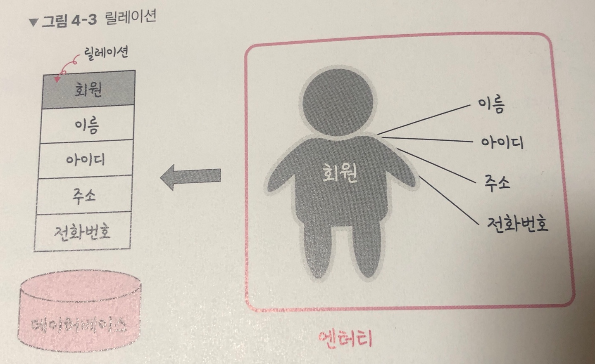
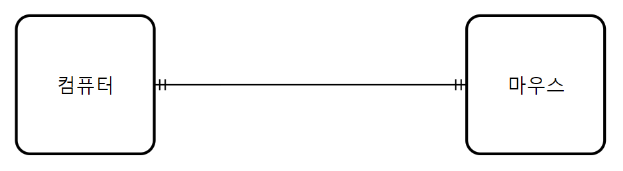
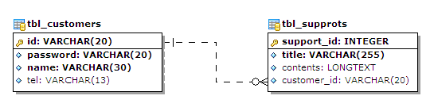
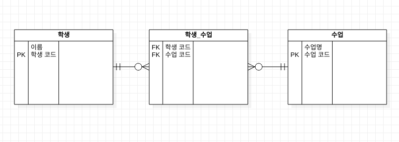

# 데이터베이스의 기본


데이터베이스(DB, DataBase) 는 일정한 규칙, 혹은 규약을 통해 구조화되어 저장되는 데이터의 모음입니다. 해당 데이터베이스를 제어, 관리하는 통합 시스템을 DBMS(DataBase Management System) 라고 하며, 데이터베이스 안에 있는 데이터들은 특정 DBMS마다 정의된 쿼리 언어(query language) 즉, **SQL** 을 통해 **CRUD** 등을 수행할 수 있습니다. 또한, 데이터베이스는 실시간 접근과 동시 공유가 가능합니다.


응용프로그램 <-> DBMS <-> Database  방식으로 이루어져있고, 데이터베이스 위에 DBMS가 있고 그 위에 응용 프로그램이 있으며, 이러한 구조를 기반으로 데이터를 주고받습니다. 예를 들어 MySQL이라는 DBMS가 있고 그 위에 응용 프로그램에 속하는 Node.js 나 Django 등등 에서 해당 데이터베이스 안에 있는 데이터를 꺼내어 해당 데이터 관련 로직을 구축할 수 있는 것이다.


## 01. 엔터티(Entity)

엔터티란 사람, 장소, 물건, 사건, 개념 등 여러 개의 속성을 지닌 명사를 의미한다. (테이블과 비슷한듯?)<br>예를 들어 회원이라는 엔터티가 있다고 하면, 회원은 이름, 아이디, 주소, 전화번호 등의 속성을 갖는다.

**물론 이보다 더 많은 속성이 있지만 서비스의 요구 사항에 맞춰 속성이 정해집니다.** 예를 들어 주소라는 속성이 서비스의 요구 사항과 무관한 속성이라면 주소라는 속성은 사라지게 됩니다.

**약한 엔터티와 강한 엔터티**

엔터티는 강한엔터티와 약한엔터티로 나뉘는데, 예를 들어 A가 혼자서는 존재하지 못하고 B의 존재 여부에 따라 종송적이라면 A는 약한 엔터티이고, B는 강한 엔터티가 됩니다.

방은 건물 안에만 존재하기 때문에

- 방: 약한 엔터티
- 건물: 강한 엔터티


## 02. 릴레이션(Relation)

릴레이션은 데이터베이스에서 정보를 구분하여 저장하는 기본 단위입니다. 엔터티에 관한 데이터를 데이터베이스는 릴레이션 하나에 담아서 관리합니다. 



위의 그림처럼 회원이라는 엔터티가 데이터베이스에서 관리될 때 릴레이션으로 변화된 것을 볼 수 있다. 릴레이션은 관계형 데이터베이스에서는 '테이블' 이라고 하며, NoSQL 데이터베이스에서는 '컬렉션' 이라고 합니다.

**테이블과 컬렉션**

DB의 종류

- RDB
  - MySQL
  - 데이터베이스 => 테이블 => 레코드로 구조가 이루어져 있다.
- NoSQL
  - MongoDB
  - 데이터베이스 => 컬렉션 => 도큐먼트로 구조가 이루어져 있다. (ES 에서는 인덱스 => 도큐먼트)


레코드가 쌓여서 테이블이 되고, 테이블이 쌓여서 데이터베이스가 되는 것이다.


## 03. 속성(Attribute)

속성은 릴레이션에서 관리하는 구체적이며 고유한 이름을 갖는 정보입니다. 예를 들어 '차'라는 엔터티의 속성을 뽑아보면 차 넘버, 바퀴 수, 색상, 차종 등이 있다. 이 중에서 서비스의 요구 사항을 기반으로 관리해야 할 필요가 있는 속성들만 엔터티의 속성이 된다. (컬럼 얘기 하는듯?)


## 04. 도메인(domain)

릴레이션(테이블)에 포함된 각각의 **속성들이 가질 수 있는 값의 집합**을 말합니다. 예를 들어 성별이라는 속성이 있다면 이 속성이 가질 수 있는 값은 {남, 여} 라는 집합이 됩니다.


## 05. 필드와 레코드

위에서 설명한 것들을 기반으로 데이터베이스에서 필드와 레코드로 구성된 테이블을 만들 수 있다.

- Column = Field
- Row = Record, Tuple

```sql
CREATE TABLE book(
	id INT NOT NULL AUTO_INCREMENT,
  title VARCHAR(255),
  author_id INT,
  publishing_year VARCHAR(255),
  genre VARCHAR(255),
  created_at DATETIME,
  updated_at DATETIME,
  PRIMARY KEY (id)
);
```


**필드 타입**

필드(컬럼)은 타입을 갖습니다. 예를들어 이름은 문자열이고 전화번호는 숫자겠죠? 이러한 타입들은 DBMS마다 다르며 여기서는 MySQL 기준으로 설명하겠습니다. 여러 가지 타입이 있고 대표적인 타입인 숫자, 날짜, 문자 타입에 대해 알아보겠습니다.

- 숫자 타입

숫자 타입으로는 TINYINT, SMALLINT, MEDIUMINT, INT, BIGINT 등이 있다.

| 타입      | 용량(바이트) | 최솟값(부호 있음) | 최솟값(부호 없음) | 최댓값(부호 없음) | 최댓값(부호 있음) |
| :-------- | :----------- | :---------------- | :---------------- | :---------------- | :---------------- |
| TINYINT   | 1            | -128              | 0                 | 127               | 255               |
| SMALLINT  | 2            | -32768            | 0                 | 32767             | 65535             |
| MEDIUMINT | 3            | -8388608          | 0                 | 8388607           | 16777215          |
| INT       | 4            | -2147483648       | 0                 | 2147483647        | 4294967296        |
| BIGINT    | 5            | -263              | 0                 | 263-1             | 264-1             |


- 날짜 타입
  - DATE
    - 날짜는 있지만 시간이 없다.
    - 1000-01-01 ~ 9999-12-31
    - 3바이트의 용량을 가진다.
  - DATETIME
    - 날짜, 시간 모두 포함
    - 1000-01-01 00:00:00 ~ 9999-12-31 23:59:59
    - 8바이트의 용량을 가진다.
  - TIMESTAMP
    - 날짜 및 시간 모두 포함
    - 1970-01-01 00:00:01 ~ 2038-01-19 03:14:07
    - 4바이트의 용량을 가진다.


- 문자타입
  - CHAR
    - 레코드를 저장할때 무조건 선언한 길이 값으로 '고정'해서 저장된다. CHAR(30) - 30자
    - 지정된 형태에 따라 저장된 CHAR의 경우 검색에 유리
  - VARCHAR
    - 가변 길이 문자열, 길이는 0~65,535 사이의 값 지정
    - 입력된 데이터에 따라 용량을 가변시켜 저장합니다.
    - 검색을 별로 하지 않고 유동적인 길이를 가진 데이터는 VARCHAR로 저장하는게 좋다.
  - TEXT, BLOB
    - 큰 데이터를 저장할 때 쓰는 타입
    - TEXT는 큰 문자열 저장에 쓰며 주로 게시판의 본문을 저장할 때 쓰인다.
    - **BLOB은 이미지, 동영상 등 큰 데이터 저장에 씁니다. 그러나 보통은 아마존의 이미지 호스팅 서비스인 S3 를 이용하는 등 서버에 파일을 올리고 파일에 관한 경로를 VARCHAR로 저장하는 추세이다.**
  - ENUM, SET
    - 문자열을 열거한 타입
    - **ENUM**('x-small', 'small', 'medium', 'large', 'x-large') 형태로 쓰이며 이 중에서 하나만 선택하는 단일 선택만 가능하고, ENUM 리스트에 없는 잘모소딘 값을 삽입하면 빈 문자열이 대신 삽입됩니다. ENUM 을 이용하면 x-small 이 0, 1 등으로 매핑되어 메모리를 적게 사용하는 이점을 얻습니다. ENUM은 최대 65,635개의 요소를 넣을 수 있다.
    - **SET**은 ENUM과 비슷하지만 여러 개의 데이터를 선택할 수 있고 비트 단위의 연산을 할 수 있으면 최대 64개의 요소를 집어넣을 수 있다.
    - 참고로 ENUM or SET 을 사용할 경우 공간적으로 이점을 볼 수 있지만 애플리케이션의 수정에 따라 데이터베이스의 ENUM or SET 에서 정의한 목록을 수정해야 한다는 단점이 있습니다.


## 06. 관계

데이터베이스의 테이블은 하나만 있는 것이 아닙니다. 여러 개의 테이블이 있고 이러한 테이블은 서로의 관계가 정의되어 있습니다.


- **1:1 관계**



예를 들어 컴퓨터 1대 당 마우스는 한 개씩 있겠죠? 이 경우 1:1 관계가 됩니다.


- **1:N 관계**



유저당 여러개의 장바구니 상품 (0개의 경우도 있으니 0도 포함하는 화살표를 통해 ERD 표현)

하나의 게시글에 여러개의 댓글, 등등


- **N:M 관계** (다대다)




학생과 수업의 관계는 학생도 수업을 많이 들을 수 있고, 수업도 여러 명의 학생을 포함할 수 있습니다.

N:M 관계에서는 **학생_수업** 이라는 테이블이 중간에 끼어 있는것을 볼 수 있는데, 다대다관계에서는 두 개를 직접적으로 연결해서 구축하지는 않고 1:N, 1:M 이라는 관계를 갖는 테이블 두 개로 나눠서 설정합니다.


## 07. 키

테이블 간의 관계를 조금 더 명확하게 하고 테이블 자체의 인덱스를 위해 설정한 장치로 **기본키, 외래키, 후보키, 슈퍼키, 대체키**가 있습니다.

- 기본키
  - PK, id 등을 설정
- 외래키 (FK)
  - 다른 테이블의 기본키를 그대로 참조하는 값, 개체와 관계를 식별하는데 사용
  - 외래키는 중복되어도 된다. (1:N) 
- 후보키
  - 기본키가 될 수 있는 후보들이며 유일성과 최소성을 동시에 만족
- 대체키
  - 후보키가 두 개 이상일 경우 어느 하나를 기본키로 지정하고, 남은 후보키들을 말합니다.
- 슈퍼키
  - 각 레코드를 유일하게 식별할 수 있는 유일성을 갖춘 키

**{id, phone_number} 처럼 두 개를 묶어서 만드는 복합키를 기본키로도 설정할 수도 있다.**


