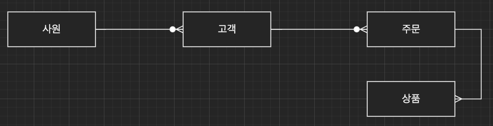

# ERD 와 정규화 과정

ERD (Entity Relationship Diagram) 는 데이터베이스를 구축할 떄 가장 기초적인 뼈대 역할을 하며, 릴레이션 간의 관계들을 정의한 것이다. 만약 서비스를 구축한다면 가장 먼저 신경 써야 할 부분이며 이 부분을 신경 쓰지 않고 서비스를 구축한다면 단단하지 않은 골조로 건물을 짓는 것이나 다름없습니다.

## 01. ERD의 중요성

ERD는 시스템의 요구 사항을 기반으로 작성되며 이 ERD를 기반으로 데이터베이스를 구축합니다. 데이터베이스를 구축한 이후에도 디버깅 또는 비즈니스 프로세스 재설계가 필요한 경우에 설계도 역할을 담당하기도 합니다.

하지만 ERD는 관계형 구조로 표현할 수 있는 데이터를 구성하는 데 유용할 수 있지만 비정형 데이터를 충분히 표현할 수 없다는 단점이 있습니다.

- **비정형 데이터**

비구조화 데이터를 말하며, 미리 정의된 데이터 모델이 없거나 미리 정의된 방식으로 정리되지 않은 정보를 말한다. MongoDB 같은 NoSQL 데이터베이스에서 주로 저장하고 사용된다.

## 02. 예제로 배우는 ERD

아래 예제의 서비스 요구 사항과 답을 기반으로 ERD를 작성해보자. 참고로 정답 ERD의 테이블 필드, 타입은 생략

- **승원 영업부서의 ERD**
  - 요구사항
    - 영업사원은 0~N명의 고객을 관리한다.
    - 고객은 0~N개의 주문을 넣을 수 있다.
    - 주문에는 1~N개의 상품이 들어간다.

- **재구 오브 레전드의 ERD**
  - 요구 사항
    - 선수들은 1명의 챔피언을 고를 수 있다.
    - 챔피언은 한 개 이상의 스킬을 갖는다.
    - 스킬은 한 개 이상의 특성을 갖는다.

## 03. 정규화 과정

> 릴레이션은 테이블이라고 생각하면 이해가 편함

정규화 과정은 릴레이션 간의 잘못된 종속 관계로 인해 데이터베이스 **이상 현상**이 일어나서 이를 해결하거나,저장 공간을 효율적으로 사용하기 위해 **릴레이션을 여러 개로 분리하는 과정**입니다. (즉, 테이블의 컬럼을 쪼개서 테이블을 분리 시키는 거라고 생각하면 될듯?)

- 데이터베이스 이상현상

회원이 한 개의 등급을 가져야 하는데 3개의 등급을 갖거나 삭제할 때 필요한 데이터가 같이 삭제되고, 데이터를 삽입해야 하는데, 하나의 필드 값이 NULL이 되면 안 되어서 삽입하기 어려운 현상을 말한다.

- 정규화 과정

  - 정규형 원칙을 기반으로 정규형을 만들어가는 과정이며, 정규화된 정도는 정규형(NF, Normal Form)으로 표현합니다. 

  - **기본 정규형**
    - 제1 정규형
    - 제2 정규형
    - 제3 정규형
    - 보이스/코드 정규형 (BCNF)

  - 고급 정규형
    - 제4 정규형
    - 제5 정규형

등이 있다. 아래에서는 기본 정규형에 대해 알아보도록 한다. (고급 정규형까진 잘 가지 않는다고 함)

### 정규형 원칙

정규형의 원칙이란 같은 의미를 표현하는 릴레이션이지만 좀 더 좋은 구조로 만들어야 하고, 자료의 중복성은 감소해야 하고, 독립적인 관계는 별개의 릴레이션으로 표현해야 하며, 각각의 릴레이션은 독립적인 표현이 가능해야 하는 것을 말한다.

### 정규형 개념 및 정의 설명

제1 정규형부터 보이스/코드정규형 까지의 자세한 설명은 아래 블로그 사진을 클릭하여 참고하길 바랍니다.

