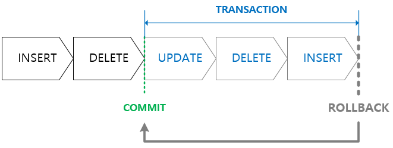
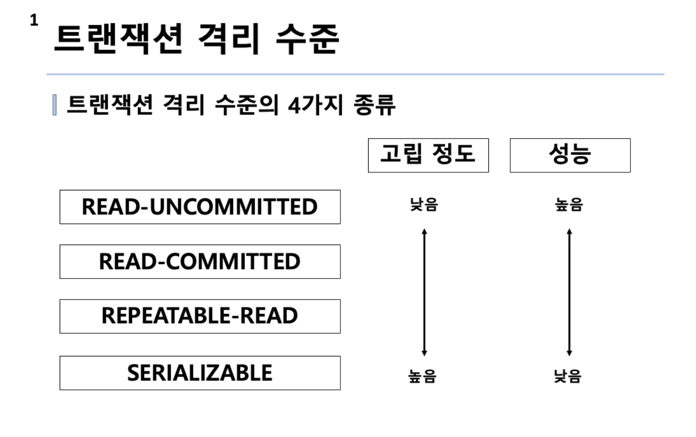

# 트랜잭션과 무결성


## 01. 트랜잭션

**트랜잭션(Transaction) 은 데이터베이스에서 하나의 논리적 기능을 수행하기 위한 작업의 단위**를 말하며, 데이터베이스에 접근하는 방법을 쿼리이므로, 즉 여러 개의 쿼리들을 하나로 묶는 단위를 말합니다. 이에 대한 특징으로는

- 원자성
- 일관성
- 독립성
- 지속성

이 있으며, 이를 한꺼번에 **ACID 특징**이라고 말합니다.


## 02. ACID

### 원자성

> All or Nothing

원자성(atomicity)은 트랜잭션과 관련된 일이 모두 수행되었거나 되지 않았거나를 보장하는 특징입니다. 예를 들어 트랜잭션을 커밋했는데, 문제가 발생하여 롤백하는 경우 그 이후에 모두 수행되지 않음을 보장하는 것을 말합니다.

예를 들어 1000만 원을 가진 홍철이가 0원을 가진 규영이에게 500만 원을 이체한다고 해봅시다. 그렇다면 결과는 홍철이는 500만 원, 규영이는 500만 원을 가지겠죠? 해당 결과는 다음과 같은 operation 단위들로 이루어진 과정을 거칩니다.

1. 홍철이의 잔고를 조회한다.
2. 홍철에게서 500만원을 뺀다.
3. 규영이에게 500만원을 넣는다.

여기서 1~3의 operation 중 데이터베이스 사용자는 이 세 가지의 과정을 볼 수도 참여할 수도 없습니다. 다만 이 과정이 모두 끝난 이후의 상황인 홍철 500만원, 규영 500만원인 상황만 보는것이죠.

여기서 작업을 '취소' 한다고 했을 때 홍철이는 다시 1000만원, 규영이는 0원을 가져야 합니다. 일부 operation만 적용된 홍철이는 500만원, 규영이는 0원이 되지 않는 것을 의미합니다. 그래서 "All or Nothing" 인 것입니다.

또한, **트랜잭션 단위로 여러 로직들을 묶을 때 외부 API를 호출하는 것이 있으면 안됩니다**. 만약 있다면 롤백이 일어났을 때 어떻게 해야 할 것인지에 대한 해결 방법이 있어야 하고 트랜잭션 전파를 신경 써서 관리해야 합니다.


**커밋과 롤백**

커밋(commit)은 여러 쿼리가 성공적으로 처리되었다고 확정하는 명령어입니다. 트랜잭션 단위로 수행되며 변경된 내용이 모두 영구적으로 저장되는 것을 말합니다. "커밋이 수행되었다."를 "하나의 트랜잭션이 성공적으로 수행되었다." 라고도 말합니다.



위의 그림처럼 update, insert, delete의 쿼리가 하나의 트랜잭션 단위로 수행되고 이후에 데이터베이스에 영구 저장됩니다.

하지만 에러나 여러 이슈 떄문에 트랜잭션 전으로 돌려야 한다면, "롤백" 해야 한다. 롤백이란, 트랜잭션으로 처리한 하나의 묶음 과정을 일어나기 전으로 돌리는 일(취소)을 말합니다.

이러한 커밋과 롤백 덕에 데이터의 무결성이 보장됩니다. 또한, 데이터 변경 전에 변경 사항을 쉽게 확인할 수 있고 해당 작업을 그룹화할 수 있습니다.


**트랜잭션 전파**

트랜잭션을 수행할 때 커넥션 단위로 수행하기 때문에 커넥션 객체를 넘겨서 수행해야 합니다. 하지만 이를 매번 넘겨주기가 어렵기도 하고 귀찮기도 하죠, 이를 넘겨서 수행하지 않고 여러 트랜잭션 관련 메서드의 호출을 하나의 트랜잭션에 묶이도록 하는 것을 트랜잭션 전파라고 합니다.

- Java

```java
@Service
@Transactional(readOnly = true)
public class MemberService {
  private final MemberRepository memberRepository;
  
  public MemberService(MemberRepository memberRepository) {
    this.memberRepository = memberRepository;
  }
}
```

위의 코드처럼 Spring 프레임워크에서는 `@Transactional` 애너테이션을 통해 여러 쿼리 관련 코드들을 하나의 트랜잭션으로 처리합니다.

(파이썬에서는 Decorator 로 처리할 수 있으며 Django에서는 Transaction.atomic 데코레이터 사용가능..ㅎ 장고개발자라 차이점을 비교하면서 포스팅하니 재미있군요,,,)


### 일관성

일관성(consistency)은 '허용된 방식'으로만 데이터를 변경해야 하는 것을 의미합니다. 데이터베이스에 기록된 모든 데이터는 여러 가지 조건, 규칙에 따라 유효함을 가져야 합니다. 예를 들어 홍철이는 1000만 원이 있고 범석이는 0원이 있다고 칩시다. 범석이가 필자한테 500만 원을 입금할 수 있을까요? 불가능합니다. 0원으로부터 500만 원이 나오는 것은 불가능하니까요. (마이너스 통장은 제외합니다.)


### 격리성

격리성(isolation)은 트랜잭션 수행 시 서로 끼어들지 못하는 것을 말합니다. 복수의 병렬 트랜잭션은 서로 격리되어 마치 순차적으로 실행되는 것처럼 작동되어야 하고, 데이터베이스는 여러 사용자가 같은 데이터에 접근할 수 있어야 합니다. 그냥 순차적으로 하면 쉽게 되겠지만 그렇게 하면 성능이 나쁘겠죠?

격리성은 여러 개의 격리 수준으로 나뉘어 격리성을 보장합니다.




[참고 블로그](https://medium.com/@sunnkis/database-%ED%8A%B8%EB%9E%9C%EC%9E%AD%EC%85%98%EC%9D%98-%EA%B2%A9%EB%A6%AC-%EC%88%98%EC%A4%80%EC%9D%B4%EB%9E%80-10224b7b7c0e) 에서 이미지 참고하였고, 더 자세한 설명이 있습니다.


- 격리 수준에 따라 발생하는 현상
  - **팬텀 리드 (Phantom read)**
    - 한 트랜잭션 내에서 동일한 쿼리를 보냈을 때 해당 조회 결과가 다른 경우
  - **반복 가능하지 않은 조회 (Non-repeatable read)**
    - 한 트랜잭션 내의 같은 행에 두 번 이상 조회가 발생했는데, 그 값이 다른 경우
    - 팬텀 리드와 다른 점은 반복 가능하지 않은 조회는 행 값이 달라질 수도 있는데, 팬텀 리드는 다른 행이 선택될 수도 있다는 것을 의미합니다.
  - **더티 리드 (dirty read)**
    - 반복 가능하지 않은 조회가 유사하며 한 트랜잭션이 실행 중일 때 다른 트랜잭션에 의해 수정되었지만 아직 '커밋되지 않은' 행의 데이터를 읽을 수 있을 때 발생합니다.


- 격리 수준
  - **Serializable**
    - 말 그대로 트랜잭션을 순차적으로 진행시키는 것을 말합니다.
    - 여러 트랜잭션이 동시에 같은 행에 접근할 수 없다.
    - 매우 엄격한 수준으로 해당 행에 대해 격리시키고, 이후 트랜잭션이 이 행에 대해 일어난다면 기다려야 합니다.
    - 그렇기 때문에 교착 상태(Dead Lock) 가 발생할 확률도 많고, 가장 성능이 떨어지는 격리수준입니다.
  - **Repeatable_Read**
    - 하나의 트랜잭션이 수정한 행을 다른 트랜잭션이 수정할 수 없도록 막아준다.
    - 하지만, 새로운 행을 추가하는 것은 막지 않습니다.
    - 따라서 이후에, 추가된 행이 발견될 수도 있습니다.
  - **Read_Committed**
    - 가장 많이 사용되는 격리 수준이다.
    - MySQL 8.0, PostgreSQL, SQL Server, Oracle에서 기본값으로 설정되어 있다.
    - READ_UNCOMMITTED 와 달리 다른 트랜잭션이 커밋하지 않은 정보는 읽을 수 없습니다.
    - 즉, 커밋 완료된 데이터에 대해서만 조회를 허용합니다.
    - 하지만, 어떤 트랜잭션이 접근한 행을 다른 트랜잭션이 수정할 수 있습니다.
    - 예를 들어, 트랜잭션 A가 수정한 행을 트랜잭션 B가 수정할 수도 있습니다.
    - 이 때문에 트랜잭션 A가 같은 행을 다시 읽을 때 다른 내용이 발견될 수도 있습니다.
  - **Read_Uncommitted**
    - 가장 낮은 격리수준으로, 하나의 트랜잭션이 커밋되기 이전에 다른 트랜잭션에 노출되는 문제가 있지만 가장 빠릅니다.
    - 데이터 무결성을 위해 되도록이면 사용하지 않는 것이 이상적이나, 몇몇 행이 제대로 조회되지 않더라도 괜찮은 거대한 양의 데이터를 '어림잡아' 집계하는 데는 사용하면 좋습니다.


### 지속성

지속성(durability)은 성공적으로 수행된 트랜잭션은 영원히 반영되어야 하는 것을 의미합니다. 이는 데이터베이스에 시스템 장애가 발생해도 원래 상태로 복구하는 회복 기능이 있어야 함을 뜻하며, 데이터베이스는 이를 위해 **체크섬, 저널링, 롤백** 등의 기능을 제공합니다.

<div class="notice--success">
  <ul>
    <h4> 체크섬 </h4>
    <li> 중복 검사의 한 형태로, 오류 정정을 통해 송신된 자료의 무결성을 보호하는 단순한 방법 </li>    
    <br><br>
    <h4> 저널링 </h4>
    <li> 파일 시스템 또는 데이터베이스 시스템에 변경 사항을 반영(commit)하기 전에 로깅하는 것, 트랜잭션 등 변경 사항에 대한 로그를 남기는 것 </li>        
  </ul>
</div>


## 03. 무결성

무결성이란 데이터의 정확성, 일관성, 유효성을 유지하는 것을 말하며, 무결성이 유지되어야 데이터베이스에 저장된 데이터 값과 그 값에 해당하는 현실 세계의 실제 값이 일치하는지에 대한 신뢰가 생깁니다. 무결성의 종류는 다음과 같습니다.

| 이름        | 설명                                                         |
| ----------- | ------------------------------------------------------------ |
| 개체 무결성 | 기본키로 선택된 필드는 빈 값을 허용하지 않습니다.            |
| 참조 무결성 | 서로 참조 관계에 있는 두 테이블의 데이터는 항상 일관된 값을 유지해야 합니다. |
| 고유 무결성 | 특정 속성에 대해 고유한 값을 가지도록 조건이 주어진 경우 그 속성 값은 모두 고유한 값을 가집니다. |
| Null 무결성 | 특정 속성 값에 NULL이 올 수 없다는 조건이 주어진 경우 그 속성 값은 NULL이 될 수 없다는 제약조건 |

