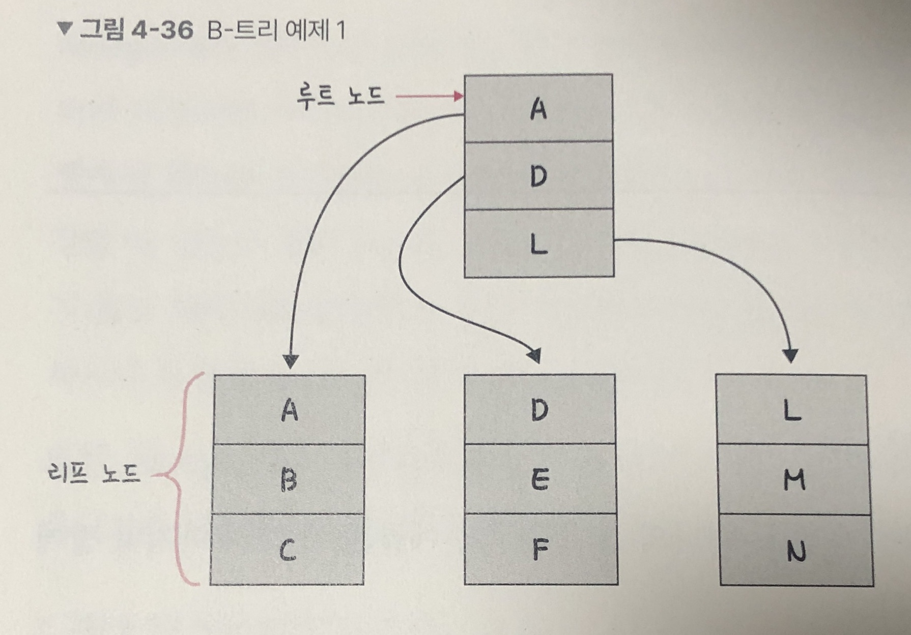
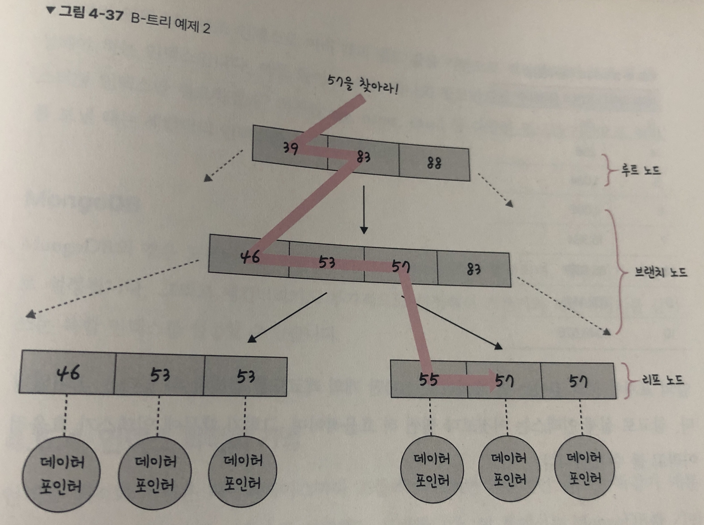

# 인덱스

> 해당 포스팅은 책과 우아한테크 유튜브 강의내용을 참고해서 글을 작성하였습니다.




## 01. 인덱스의 필요성

인덱스는 데이터를 빠르게 찾을 수 있는 하나의 장치입니다. 예를 들어 책의 마지막 장에 있는 찾아보기를 생각하면 됩니다.

책의 본문이 있고 그 본문 안에 내가 찾고자 하는 '항목'을 찾아보기를 통해 빠르게 찾을 수 있습니다. 이와 마찬가지로 인덱스를 설정하면 테이블 안에 내가 찾고자 하는 데이터를 빠르게 찾을 수 있습니다.


## 02. B-Tree

**인덱스는 보통 B-트리라는 자료구조로 이루어져 있습니다.** 이는 **루트 노드, 브랜치 노드, 리프 노드**로 나뉩니다. 먼저 루트 노드와 리프 노드를 기반으로 설명하면 다음과 같습니다.



예를 들어 E를 찾는다고 하면 전체 테이블을 탐색하는 것이 아니라 E가 있을 법한 리프 노드로 들어가서 E를 탐색하면 쉽게 찾을 수 있죠. 이 자료 구조 없이 E를 참색하고자 하면 A, B, C, D, E 다섯 번을 탐색해야 하지만, 이렇게 노드들로 나누면 두 번만에 리프 노드에서 찾을 수 있습니다.

좀 더 자세한 예를 들어 보죠. 키 57에 해당하는 데이터를 검색해야 한다고 해봅시다.





트리 탐색은 맨 위 루트 노드부터 탐색이 일어나며 브랜치 노드를 거쳐 리프 노드까지 내려옵니다. '57보다 같거나 클 때까지 <=' 를 기반으로 처음 루트 노드에서는 39, 83 이후 아래 노드로 내려와 46, 53, 57 등 정렬된 값을 기반으로 탐색하는 것을 볼 수 있습니다. 이렇게 루트 노드부터 시작하여 마지막 리프 노드에 도달해서 57이 가리키는 데이터 포인터를 통해 결괏값을 반환하게 됩니다.


**인덱스가 효율적인 이유와 대수확장성**

인덱스가 효율적인 이유는 효율적인 단계를 거쳐 모든 요소에 접근할 수 있는 균형 잡힌 트리 구조와 트리 길이의 대수확장성 때문입니다. 대수확장성이란 트리 깊이가 리프 노드 수에 비해 매우 느리게 성장하는 것을 의미합니다. 기본적으로 인덱스가 한 깊이씩 증가할 때마다 최대 인덱스 항목의 수는 4배씩 증가합니다.


- 트리의 대수확장성

| 트리 깊이 | 인덱스 항목의 수 |
| --------- | ---------------- |
| 3         | 64               |
| 4         | 256              |
| 5         | 1,024            |
| 6         | 4,096            |
| 7         | 16.384           |
| 8         | 65.536           |
| 9         | 262,144          |
| 10        | 1,048,576        |


위의 표처럼 트리 깊이는 열 개 짜리로, 100만 개의 레코드를 검색할 수 있다는 의미입니다. 참고로 실제 인덱스는 이것보다 훨씬 더 효율적이며, 그렇기 때문에 인덱스를 효율적이라고 볼 수 있습니다.


## 03. 인덱스 만드는 방법

인덱스를 만드는 방법은 데이터베이스마다 다르며 MySQL과 MongoDB를 기준으로 설명합니다.

<br>

**MySQL**

- **클러스터형 인덱스**
  - 테이블당 하나 설정 가능
  - primary key 옵션으로 기본키로 만들면 클러스터형 인덱스로 자동생성 된다.
  - Unique, not null 옵션을 주면 인덱스가 되며, primary 옵션보다는 우선순위가 낮다.
- **논-클러스터형 인덱스 (세컨더리 인덱스)**
  - `create index..` 명령어를 기반으로 만들면 세컨더리 인덱스를 만들수 있습니다.
  - 보조 인덱스로 여러 개의 필드 값을 기반으로 쿼리를 많이 보낼 때 생성해야 하는 인덱스


하나의 인덱스만 생성할 것이라면 클러스터형 인덱스를 만드는 것이 세컨더리 인덱스를 만드는 것보다 성능이 좋습니다.

age라는 하나의 필드만으로 쿼리를 보낸다면 클러스터형 인덱스만 필요할 것이고, 하지만 age, name, email 등 다양한 필드를 기반으로 쿼리를 보낼 떄는 세컨더리 인덱스를 사용해야 합니다.

<br>

**MongoDB**

MongoDB의 경우 도큐먼트를 만들면 자동으로 ObjectID가 생성되며, 해당 키가 기본키로 설정됩니다. 그리고 세컨더리키도 부가적으로 설정해서 기본키와 세컨더리키를 같이 쓰는 복합 인덱스를 설정할 수 있습니다.


## 04. 인덱스 최적화 기법

인덱스 최적화 기법은 데이터베이스마다 조금씩 다르지만 기본적인 골조는 똑같기 때문에 특정 데이터베이스를 기준으로 설명해도 무방합니다. 이 글에서는 MongoDB를 기반으로 인덱스 최적화 기법을 설명하며, 이를 기반으로 다른 데이터베이스에 웬만큼 적용할 수 있습니다.

**1. 인덱스는 비용이다.**

먼저 인덱스는 두 번 탐색하도록 강요합니다. 인덱스 리스트, 그다음 컬렉션 순으로 탐색하기 때문이며, 관련 읽기 비용이 들게 됩니다. 또한, 컬렉션이 수정되었을 때 인덱스로 수정되어야 합니다. 마치 책의 본문이 수정되었을 때 목차나 찾아보기도 수정해야 하듯이 말이죠. 이때 B-트리의 높이를 균형 있게 조절하는 비용도 들고, 데이터를 효율적으로 조회할 수 있도록 분산시키는 비용도 들게 됩니다.

그렇기 때문에 쿼리에 있는 필드에 인덱스를 무작정 다 설정하는 것은 답이 아닙니다. 또한, 컬렉션에서 가져와야 하는 양이 많을수록 인덱스를 사용하는 것은 비효율적입니다.

**2. 항상 테스팅하라**

인덱스 최적화 기법은 서비스 특징에 따라 달라집니다. 서비스에서 사용하는 객체의 깊이, 테이블의 양 등이 다르기 때문이죠. 그렇기 때문에 항상 테스팅하는 것이 중요합니다. `explain() ` 함수를 통해 인덱스를 만들고 쿼리를 보낸 이후에 테스팅을 하며 걸리는 시간을 최소화해야 합니다.

참고로 MySQL에서는 다음과 같은 코드로 테스팅을 수행합니다.

```sql
EXPLAIN
SELECT * FROM t1
	JOIN t2 ON t1.c1 = t2.c1
```


**3. 복합 인덱스는 같음, 정렬, 다중 값, 카디널리티 순이다.**

보통 여러 필드를 기반으로 조회를 할 때 복합 인덱스를 생성하는데, 이 인덱스를 생성할때는 순서가 있고 생성 순서에 따라 인덱스 성능이 달라집니다. 같음, 정렬, 다중값, 카디널리티 순으로 생성해야 합니다.

1. 어떠한 값과 같음을 비교하는 ==이나 equal이라는 쿼리가 있다면 제일 먼저 인덱스로 설정합니다.
2. 정렬에 쓰는 필드라면 그다음 인덱스로 설정합니다.
3. 다중 값을 출력해야 하는 필드, 즉 쿼리 자체가 > 이거나 < 등 많은 값을 출력해야 하는 쿼리에 쓰는 필드라면 나중에 인덱스를 설정합니다.
4. 유니크한 값의 정도를 [카디널리티](https://itholic.github.io/database-cardinality/)라고 합니다. 이 **카디널리티가 높은 순서를 기반으로 인덱스를 생성해야 합니다**. 예를 들어 age와 email이 있다고 하면, 어떤 것이 더 높을까요? 당연히 email 입니다. 즉, email이라는 필드에 대한 인덱스를 먼저 생성해야 하는 것입니다.


- 카디널리티의 대한 자세한 포스팅
  - https://itholic.github.io/database-cardinality/ 참고, 인덱스 순서 중요!


중복도가 ‘낮으면’ 카디널리티가 ‘높다’고 표현한다.<br>
중복도가 ‘높으면’ 카디널리티가 ‘낮다’고 표현한다.

주민등록번호 같은 경우는 중복되는 값이 없으므로 카디널리티가 높다고 할 수 있다.