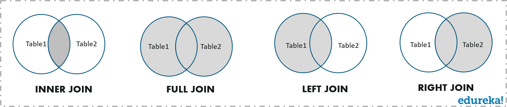
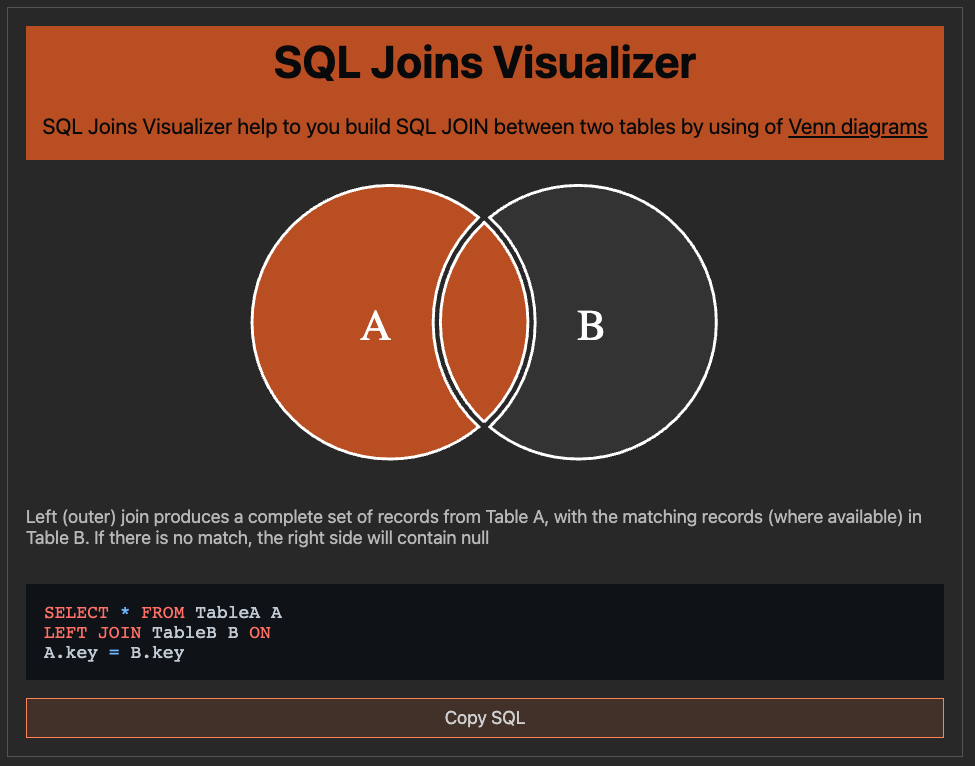

# 조인의 종류

조인(join) 이란 하나의 테이블이 아닌 두 개 이상의 테이블을 묶어서 하나의 결과물을 만드는 것을 말합니다. MySQL에서는 `JOIN` 이라는 쿼리로, MongoDB에서는 `lookup` 이라는 쿼리로 이를 처리할 수 있습니다.

참고로 MongoDB를 사용할 때 lookup은 되도록 사용하지 말아야 합니다. MongoDB는 조인 연산(lookup)에 대해 관계형 데이터베이스보다 성능이 떨어진다고 여러 벤치마크 테스트에서 알려져있기 때문입니다.

따라서 여러 테이블을 조인하는 작업이 많을 경우 MongoDB보다는 관계형 데이터베이스를 써야 합니다.

조인의 종류 중 대표적인 **내부 조인, 왼쪽 조인, 오른쪽 조인, 합집합 조인**을 살펴보도록 하겠습니다.




위의 그림처럼 두 테이블 간의 교집합이 있다고 할 때, 다음과 같은 네 가지 조인이 있습니다.

- **내부조인(inner join)**: 왼쪽 테이블과 오른쪽 테이블의 두 행이 모두 일치하는 행이 있는 부분만 표기합니다.
- **왼쪽조인(left outer join)**: 왼쪽 테이블의 모든 행이 결과 테이블에 표기됩니다.
- **오른쪽 조인(right outer join)**: 오른쪽 테이블의 모든 행이 결과 테이블에 표기됩니다.
- **합집합 조인(full outer join)**: 두 개의 테이블을 기반으로 조인 조건에 만족하지 않는 행까지 모두 표기합니다.


SQL의 JOIN을 시각화해서 볼 수 있는 사이트가 있습니다. 이 사이트를 통해 어떻게 JOIN을 구축해야 하는지 쉽게 확인할 수 있습니다.

- SQL JOIN 시각화 사이트 링크: [https://sql-joins.leopard.in.ua/](https://sql-joins.leopard.in.ua/)



앞으로 설명할 때 왼쪽 테이블은 A, 오른쪽 테이블은 B라고 설명하겠습니다.


## 01. 내부 조인

내부 조인(inner join)은 두 테이블 간에 교집합을 나타냅니다.

```sql
SELECT *
FROM TableA A
	INNER JOIN TableB B ON A.key = B.key
```


## 02. 왼쪽 조인

왼쪽 조인(left join)은 테이블B의 일치하는 부분의 레코드와 함께 테이블 A를 기준으로 완전한 레코드 집합을 생성합니다. 만약 **테이블 B에 일치하는 항목이 없으면 해당 값은 null** 이 됩니다.

```sql
SELECT *
FROM TableA A
	LEFT JOIN TableB B ON A.key = B.key
```


## 03. 오른쪽 조인

오른쪽 조인(right join)은 테이블 A에서 일치하는 부분의 레코드와 함께 테이블 B를 기준으로 완전한 레코드 집합을 생성합니다. **만약 테이블 A에 일치하는 항목이 없으면 해당 값은 null**이 됩니다.

```sql
SELECT *
FROM Table A
	RIGHT JOIN TableB B ON A.key = B.key
```


## 04. 합집합 조인

합집합 조인(완전 외부 조인) full outer join 이란, 양쪽 테이블에서 일치하는 레코드와 함께 테이블 A와 테이블 B의 모든 레코드 집합을 생성합니다. 이때 일치하는 항목이 없으면 누락된 쪽에 null값이 포함되어 출력됩니다.

```sql
SELECT *
FROM TableA A
	FULL OUTER JOIN TableB B ON A.key = B.key
```


# 조인의 원리

앞서 설명한 조인은 조인의 원리를 기반으로 조인 작업이 이루어집니다. 조인의 원리인

- 중첩 루프 조인
- 정렬 병합 조인
- 해시 조인

에 대해 알아보겠습니다. 앞서 설명한 조인의 종류는 이 원리를 기반으로 조인을 하는 것입니다.


## 01. 중첩 루프 조인

중첩 루프 조인(NLJ, Nested Loop Join)은 중첩 for문과 같은 원리로 조건에 맞는 조인을 하는 방법이며, **랜덤 접근에 대한 비용이 많이 증가하므로 대용량의 테이블에서는 사용하지 않습니다.**

예를 들어 "t1, t2 테이블을 조인한다." 라고 했을 때 첫 번째 테이블에서 행을 한 번에 하나씩 읽고 그 다음 테이블에서도 행을 하나씩 읽어 조건에 맞는 레코드를 찾아 결과값을 반환합니다.

```python
for each row in t1 matching reference key {
  for each row in t2 matching reference key {
    if row satisfies join conditions, send to client
  }
}
```

*이중포문 완전탐색 하는느낌이라 O(n^2) 걸릴것 같은 느낌 (느리다...?)*

참고로 중첩 루프 조인에서 발전한 조인할 테이블을 작은 블록으로 나눠서 블록 하나씩 조인하는 블록 중첩 루프 조인 이라는 방식도 있습니다.


## 02. 정렬 병합 조인

정렬 병합 조인이란 각각의 테이블을 조인할 필드 기준으로 정렬하고, 정렬이 끝난 이후에 조인 작업을 수행하는 조인입니다. 조인할 때 쓸 적절한 인덱스가 없고 대용량의 테이블들을 조인하고 조인 조건으로 <, > 등 범위 비교 연산자가 있을 때 씁니다.


## 03. 해시 조인

해시 조인은 해시 테이블을 기반으로 조인하는 방법입니다. 두 개의 테이블을 조인한다고 했을 때 하나의 테이블이 메모리에 온전히 들어간다면 보통 중첩 루프 조인보다 더 효율적입니다.(메모리에 올릴 수 없을 정도로 크다면 디스크를 사용하는 비용이 발생됩니다.) 또한, 동등(=) 조인에서만 사용할 수 있습니다.

MySQL의 경우 MySQL 8.0.18 릴리스와 함께 이 기능을 사용할 수 있게 되었으며 이를 기반으로 해시 조인의 과정을 살펴보겠습니다. MySQL의 해시 조인 단계는 빌드 단계, 프로브 단계로 나뉩니다.

**빌드 단계**

빌드 단계는 입력 테이블 중 하나를 기반으로 메모리 내 해시 테이블을 빌드하는 단계입니다. 예를 들어 persons와 countrie라는 테이블을 조인한다고 했을 때, **둘 중에 바이트가 더 작은 테이블을 기반으로 해시 테이블을 빌드**합니다.

또한, 조인에 사용되는 필드가 해시 테이블의 키로 사용됩니다.


**프로브 단계**

프로브 단계 동안 레코드 읽기를 시작하며, 각 레코드에서 'persons_country_id'에 일치하는 레코드를 찾아서 결과값으로 반환합니다.

이를 통해 각 테이블을 한 번씩만 읽게 되어 중첩해서 두 개의 테이블을 읽는 중첩 루프 조인보다 보통은 성능이 더 좋습니다. 참고로 사용 가능한 메모리양은 시스템 변수 join_buffer_size에 의해 제어되며, 런타임 시에 조정할 수 있습니다.


# DB 정리

- 데이터베이스는 무엇인가?
  - 데이터베이스 (DB) 는 일정한 규칙, 혹은 규약을 통해 구조화되어 저장되는 데이터의 모음
  - 데이터베이스를 제어, 관리하는 통합 시스템을 DBMS라고 한다.
  - 데이터베이스 안에 있는 데이터들은 특정 DBMS마다 정의된 쿼리 언어(query language)를 통해 CRUD등을 수행할 수 있다.
  - 실시간 접근과 동시 공유가 가능하다


- 중첩 루프 조인이란?
  - 중첩 for문과 같은 원리로 조건에 맞는 조인을 하는 방법
  - 랜덤 접근에 대한 비용이 많이 증가하므로 대용량 테이블에는 사용하지 않는다.
  - t1, t2테이블을 조인한다면, 첫 번째 테이블에서 행을 한번에 하나씩 읽고, 그 다음 테이블에서도 행을 하나씩 읽어 조건에 맞는 레코드를 찾아서 결과값을 반환한다.
  - 이중포문 완전탐색이랑 비슷한느낌이라 느릴것같음


- 인덱스를 필드마다 설정하는 것이 좋은가?
  - 먼저 인덱스는 두 번 탐색을 강요합니다.
  - 인덱스 리스트, 그다음 컬렉션 이렇게 두 번 탐색하기 때문이며 읽기 관련 비용이 더 들게 됩니다.
  - 그렇기 때문에 매 필드마다 설정하는 것은 고찰해봐야 합니다.
  - 또한 테이블이 수정되면 인덱스도 수정되어야 합니다.
  - 인덱스를 수정하는 것은 a=1 을 a=2 처럼 값만 수정하는 것보다 쉽지도 않습니다.
  - B-트리 구조를 사용하기 때문에 트리의 높이를 균형 있게 조절하는것도 비용이 들고 데이터를 분산시켜서 효율적으로 조회할 수 있도록 구축하는 비용도 듭니다.
  - 필드에 인덱스를 무작정으로 다 설정하는 것은 답이 아니다.
  - 컬렉션에서 가져와야 하는 양이 많을수록 인덱스를 사용하는 것은 비효율적