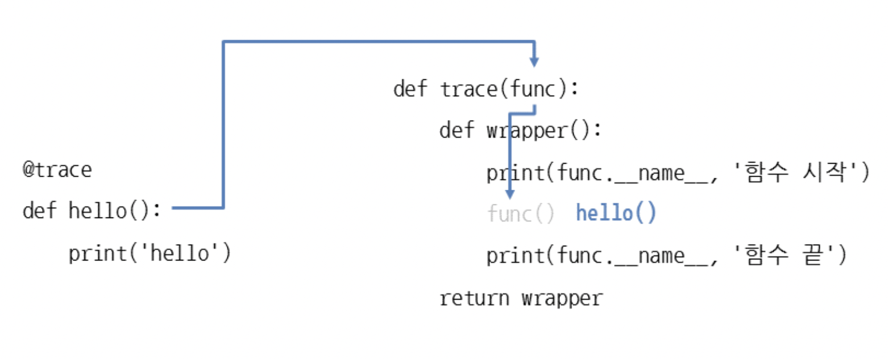

# TL;DR

> **선결론 및 요약**
>
> 개념 및 더 자세한 설명이 필요하신분은 아래 내용을 읽어주세요.
> - 2중 데코레이터
>   - 흔히 쓰이는 데코레이터
>
> - 3중 데코레이터
>   - 데코레이터에 인자를 받고싶을때 사용하는 데코레이터 작성법

**아래 두가지 방법으로 데코레이터를 만들고 사용할수 있다는 점만 꼭 기억하도록 하자.**

- 2중 데코 예시
  - 가장 일반적인 데코레이터
  - 실무에서 가장 많이 쓰이게 되는 데코레이터

```python
import functools

def decorator(func):
    @functools.wraps(func)
    def wrapper(*args, **kwargs):
        print('함수가 실행되기전 로직')
        result = func(*args, **kwargs)
        print('함수가 실행된 후 로직')
        return result
    return wrapper

@decorator
def add(a: int, b: int) -> int:
    return a + b

result = add(1, 2)
print(result)


```


- 3중 데코 예시
  - 데코레이터에 인자를 받고싶을때 사용하는 작성법
  - 흔히 쓰이진 않지만 데코레이터에 인자값에 따라 다르게 로직을 구성할때 사용

```python
import functools

def add_emotion(emotion: str = '^3^'):
    def wrapper(func):
        @functools.wraps(func)
        def inner(*args, **kwargs):
            print(emotion, ' ', end='')
            result = func(*args, **kwargs)
            print('함수 실행후 진행할 로직')
            return result
        return inner
    return wrapper

@add_emotion('ㅡ3ㅡ')
# @add_emotion()
def add(a: int, b: int) -> int:
    return a + b

result = add(1, 2)
print(result)
```


# 1. Decorator

> 파이썬의 데코레이터라는 기능을 알아보자.

클래스에서 메서드를 만들때 `@classmethod` `@staticmethod` `@abstractmethod` 등의 키워드를 사용했었는데, 이렇게 `@함수명` 으로 시작하는것들이 데코레이터입니다. 즉, 함수(메서드)를 장식한다고해서 이런 이름이 붙게 되었다.

```python
class Calc:
  @staticmethod
  def add(a: int, b: int) -> int:
    return a + b
  
  @classmethod
  def sub(a: int, b: int) -> int:
    return a - b
  
  @abstractmethod
  def devide(a: int, b: int) -> float:
    return a / b
```

데코레이터를 만들고 사용하는법에 대해 알아보자.


## 01. 데코레이터 만들기

- 데코레이터는 도대체 어디에 사용하는것일까?
- **데코레이터는 함수를 수정하지 않은 상태에서 추가 기능을 구현할 때 사용된다.**
- 예를들어, 함수의 시작과 끝을 출력하고 싶다면 다음과 같이 함수 시작, 끝 부분에 print 를 넣어주어야 한다.

```python
def hello():
  print('hello 함수 시작')
  print('hello')
  print('hello 함수 종료')
  
def world():
  print('world 함수 시작')
  print('world')
  print('world 함수 종료')
  
hello()
world()

# hello 함수 시작
# hello
# hello 함수 끝
# world 함수 시작
# world
# world 함수 끝
```


- 만약 다른 함수도 시작과 끝을 출력하고 싶다면 함수를 만들때마다 print 를 넣어야 한다.
- 함수가 많아지면 매우 번거로워진다.
- 이런경우, 데코레이터를 활용하면 편리하다.
- 아래는 함수의 시작과 끝을 출력하는 데코레이터이다.

```python
def trace(func):                             # 호출할 함수를 매개변수로 받음
    def wrapper():                           # 호출할 함수를 감싸는 함수
        print(func.__name__, '함수 시작')    # __name__으로 함수 이름 출력
        func()                               # 매개변수로 받은 함수를 호출
        print(func.__name__, '함수 끝')
    return wrapper                           # wrapper 함수 반환
 
def hello():
    print('hello')
 
def world():
    print('world')
 
trace_hello = trace(hello)    # 데코레이터에 호출할 함수를 넣음
trace_hello()                 # 반환된 함수를 호출
trace_world = trace(world)    # 데코레이터에 호출할 함수를 넣음
trace_world()                 # 반환된 함수를 호출

```


## 02. @ 로 데코레이터 사용하기

```python
@decorator
def func():
  something..
```


```python
def trace(func):
  def wrapper():
    print(func.__name__, '함수 시작')
    func()
    print(func.__name__, '함수 끝')
  return wrapper

@trace
def hello():
  print('hello')
  
@trace
def world():
  print('world')
  
hello()
world()
```





## 03. 데코레이터 여러개 지정하기

> 데코레이터를 여러개 지정하면 위에서 아래로 순서대로 실행된다.

```python
def decorator1(func):
    def inner():
        print('decorator1')
        func()
    return inner

def decorator2(func):
    def inner():
        print('decorator2')
        func()
    return inner

@decorator1
@decorator2
def hello():
    print('hello')


hello()

# decorator1
# decorator2
# hello
```


## 04. Class 형태로 decorator 를 사용해보자.

> 데코레이터를 class형태로 사용하려면 아래와 같이 `__call__` 함수로 decorator 형식을 정의해주면 된다.<br>class의 `__call__` 함수로 정의해주는게 nested 함수 형식으로 정의한것보다 깔끔해 보인다는 의견도 있다.

```python
import datetime

class DatetimeDecorator:
        def __init__(self, f):
                self.func = f

        def __call__(self, *args, **kwargs):
                print datetime.datetime.now()
                self.func(*args, **kwargs)
                print datetime.datetime.now()

class MainClass:
        @DatetimeDecorator
        def main_function_1():
                print "MAIN FUNCTION 1 START"

        @DatetimeDecorator
        def main_function_2():
                print "MAIN FUNCTION 2 START"

        @DatetimeDecorator
        def main_function_3():
                print "MAIN FUNCTION 3 START"


my = MainClass()
my.main_function_1()
my.main_function_2()
my.main_function_3()
```

**출처: https://bluese05.tistory.com/30 [ㅍㅍㅋㄷ:티스토리]**


## 05. 데코레이터로 원래 함수의 인자 그대로 넘기기

```python
def decorator(func):
    def inner(*args, **kwargs):
        print('decorator call')
        func(*args, **kwargs)
    return inner

@decorator
def hello(name, age):
    print(f'hello, my name is {name}')
    print(f'hello, my age is {age}')


hello('jaegu', 29)
```


- decorator 를 정의할때, 함수가 받는 인자값 그대로 넘기는것도 가능하다.


## 06. 데코레이터로부터 원래 함수의 리턴값 그대로 받기

어떤 값을 리턴하는 함수에다가 데코레이터를 적용해보자.

```python
def decorator(func):
    def inner(*args, **kwargs):
        print('decorator start!')
        res = func(*args, **kwargs)
        print('decorator finish!')
        return res
    return inner

@decorator
def add(a: int, b: int) -> int:
    return a + b

result = add(1, 2)
print(result)  # 3
```


## 07. functools.wraps 활용하기

- 데코레이터를 사용할때 문제는, 원래 함수의 메타 정보가 데코레이터의 메타 정보로 대체된다는 것

```python
@decorate
def say_hi():
  print('hi')
  
say_hi
# <function decorate.<locals>.wrapper at 0x10e5690d0>
say_hi.__name__
# wrapper
```


- 아래와 같이 사용하게되면 위와 같은 문제를 해결할 수 있다.
- **실무에서 가장 많이 활용하게 될 코드**

```python
import functools

def decorator(func):
    @functools.wraps(func)
    def wrapper(*args, **kwargs):
        print('함수가 실행되기전 로직')
        result = func(*args, **kwargs)
        print('함수가 실행된 후 로직')
        return result
    return wrapper

@decorator
def add(a: int, b: int) -> int:
    return a + b

result = add(1, 2)
print(result)

```


# 2. 인자를 가지는 Decorator

> 위에서는 단순하게 데코레이터를 붙이기만 했지만, 데코레이터에 인자를 넣어서 실행할수도 있다.
>
> **3중으로 함수를 만들어야 하므로 헷갈릴 수 있음 주의.**

```python
import functools

def add_emotion(emotion: str = '^3^'):
    def wrapper(func):
        @functools.wraps(func)
        def inner(*args, **kwargs):
            print(emotion, ' ', end='')
            result = func(*args, **kwargs)
            print('함수 실행후 진행할 로직')
            return result
        return inner
    return wrapper

@add_emotion('ㅡ3ㅡ')
# @add_emotion()
def add(a: int, b: int) -> int:
    return a + b

result = add(1, 2)
print(result)
```


# 03. 여러가지 데코레이터 예시


- 함수의 결과값의 데이터가 80자 초과면 에러발생

```python
def validate_summary(func):
    def wrapper(*args, **kwargs):
        data = func(*args, **kwargs)
        if len(data["summary"]) > 80:
            raise ValueError("Summary too long")
        return data
    return wrapper
 

@validate_summary
def fetch_customer_data():
    # ...

@validate_summary
def query_orders(criteria):
    # ...

@validate_summary
def create_invoice(params):
    # ...
```


- 재시도 데코레이터
- **삼중 데코레이터로 재시도 횟수를 받게끔 수정을 시도해볼 수도 있을것같네요.**
  - **지금 현재는 최대 3번까지 재시도 자동**

```python
# 데코레이터가 적용된 함수에서는 Response 객체를 반환하고
# 이 객체에는 status_code 속성이 포함돼 있습니다.
# 200은 성공을 의미하고, 500은 서버 측 오류를 의미합니다.

def retry(func):
    def retried_func(*args, **kwargs):
        MAX_TRIES = 3
        tries = 0
        while True:
            resp = func(*args, **kwargs)
            if resp.status_code == 500 and tries < MAX_TRIES:
                tries += 1
                continue
            break
        return resp
    return retried_func

 
이렇게 하면 사용하기 쉬운 @retry 데코레이터가 만들어집니다.

@retry
def make_api_call():
    # ....
```
