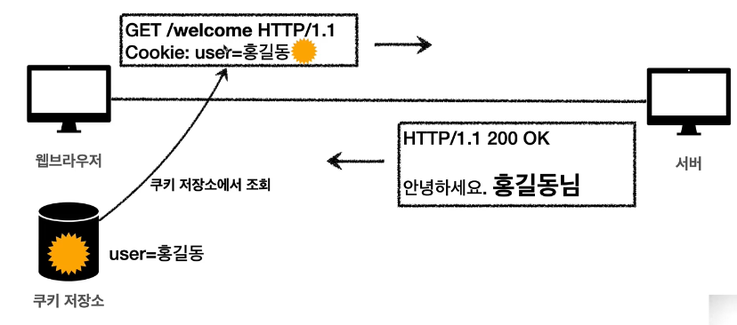
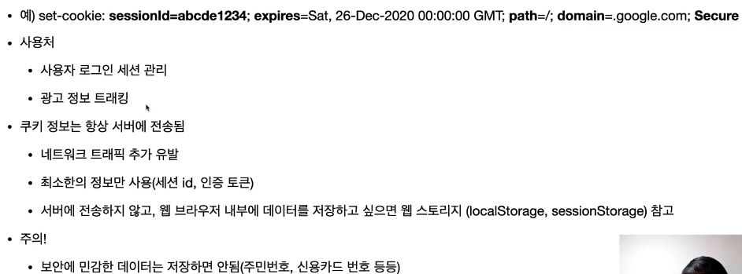

# HTTP Header

> HTTP 통신에서 header 에 들어가는 메타정보들에 대해 정리하는 글

## 표현계층

> 표현헤더는 전송, 응답 둘다 사용

- `Content-Type` : 표현 데이터의 형식
- `Content-Encoding` : 표현 데이터의 압축 방식
- `Content-Language` : 표현 데이터의 자연 언어
- `Content-Length` : 표현 데이터의 길이

## 협상 (콘텐츠 네고시에이션)

> request 헤더에 담아서보내면, 서버에게 이런 타입으로 리턴해달라고 요청하는 의미
>
> **협상헤더는 요청시에만 사용**

- `Accept` : 클라이언트가 선호하는 미디어 타입 전달
- `Accept-Charset` : 클라이언트가 선호하는 문자 인코딩
- `Accept-Encoding` : 클라이언트가 선호하는 압축 인코딩
- `Accept-Language` : 클라이언트가 선호하는 자연 언어

## 전송방식

> - Transfer-Encoding
> - Range, Content-Range

- 단순 전송
  - 컨텐츠길이를 지정하고, 단순하게 요청하고 한번에 다 주고 받는 것
- 압축 전송
  - gzip 과 같은 압축방식으로 압축해서 전송해줌
  - Content-Encoding: gzip 과 같은 응답헤더가 같이 전송하게 되어있음
- 분할 전송
  - Transfer-Encoding: chunked 와 같은 응답헤더가 옴
  - 덩어리를 쪼개서 보낸다라는 의미
  - 분할 전송일때는 Content-Length 를 보내면 안된다.
- 범위 전송
  - Range, Content-Range
  - 이미지를 받다가 중간에 끊겨서 다시 요청
  - 처음부터 다시 요청하면 리소스낭비이니, 어느 범위에서 어느범위까지 재요청하는 것

## 일반정보

- From
  - 유저 에이전트의 이메일 정보
  - 잘 사용되지 않음 X
  - 요청에서 사용
- Referer
  - 이전 웹 페이지 주소
  - **자주 사용되는 헤더정보**
  - A -> B 로 이동하는 경우에 B 를 요청할 때 Referer: A 를 포함해서 요청
  - 유입 경로 분석 가능
  - 요청에서 사용된다.
- User-Agent
  - 내 웹브라우저 정보
  - 클라이언트 애플리케이션 정보
  - 어떤 종류의 브라우저에서 장애가 발생하는지 파악 가능
  - 통계 정보 (어떤 브라우저에서 많이 접속하는지 같은)
  - 요청에서 사용
- Server
  - 요청을 처리하는 Origin 서버의 소프트웨어 정보
  - Server: Apache/2.2.22
  - Server: nginx
  - **응답에서 사용**
- Date
  - 메시지가 발생한 날짜와 시간
  - 응답에서만 사용
  - Date: Tue, 15 Nov 1994 08:12:31 GMT

## 특별한 정보

- **Host**
  - 요청한 호스트 정보 (도메인)
  - **요청에서 사용**
  - 필수
  - 하나의 서버에 여러 도메인을 가지고있을 때, 어느 도메인에서 처리해달라고 요청하는 정보
  - 하나의 IP 주소에 여러 도메인이 적용되어 있을 때
- **Location**
  - 페이지 리다이렉션
  - 웹 브라우저는 3xx 응답결과에 Location 헤더가 있으면, 자동 리다이렉트 한다.
  - 201 (created) 에서 오는 location 응답헤더는 요청에 의해 생성된 리소스 URI
  - 3xx (redirection) Location 값은 요청을 자동으로 리다이렉션하기 위한 대상 리소스를 가리킴
- Allow
  - 허용 가능한 HTTP 메서드
  - 405 Method Not Allowed
- Retry-After
  - 50 서비스가 언제까지 불능인지 알려줄 수 있음
  - 유저 에이전트가 다음 요청을 하기까지 기다려야 하는 시간

## 인증

- Authorization
  - 클라이언트 인증 정보를 서버에 전달
  - Basic, Oauth, Bearer, JWT 등등..
- WWW-Authenticate
  - 리소스 접근시 필요한 인증 방법 정의
  - 401 응답과 함께 사용 (로그인해라)

## 쿠키

> 자주 사용되고 중요
>
> 요청이 Stateless 하기 때문에 상태를 유지하고 싶으면 쿠키를 사용하면 된다.
>
> 웹브라우저 내부에 쿠키저장소가 있음
>
> - 사용처
>   - 사용자 로그인 세션 관리 (세션로그인 방식)
>   - 광고 정보 트래킹
> - 쿠키 정보는 항상 서버에 전송됨

- Set-Cookie
  - 서버에서 클라이언트로 쿠키 전달(응답)
  - Expires 만료시간을 정해줄수 있음 (시간, 또는 날짜)
- Cookie
  - 클라이언트가 서버에서 받은 쿠키를 저장하고, HTTP 요청시 서버로 전달

쿠키 보안

- Secure
  - 쿠키는 http, https 구분하지 않고 전송
  - Secure 적용하면 https 인 경우만 전송
- HttpOnly
  - XSS 공격방지
  - 자바스크립트에서 접근 불가 (document.cookie)
- SameSite
  - XSRF 공격방지
  - 요청 도메인과 쿠키에 설정된 도메인이 같은 경우만 쿠키 전송

