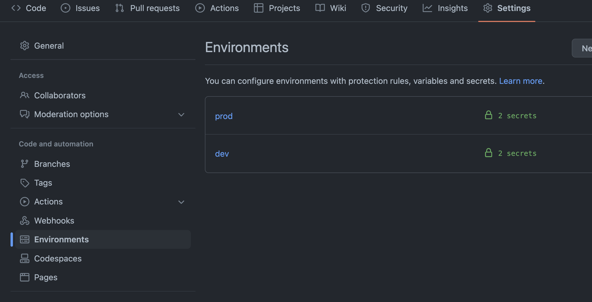
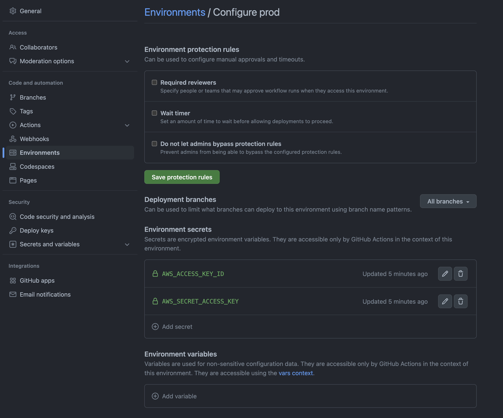

# Github Action 환경변수


1. Repository - Settings - 좌측탭 - Enviroments




2. 환경변수 등록하기




3. Github Action Workflow 에서 사용하기

dev / prod 환경별로 다른 환경변수 값을 가져갈 수 있다.

```yaml
name: 🚀 [CICD 테스트...]

on:
  push:
    branches: [main]

concurrency:
  group: deploy-test
  cancel-in-progress: true

env:
  APP_ENV: test
  ECR_NAME: my-backend-test

jobs:
  build:
    name: build
    environment: prod  # !! 이 부분이 위 사진에서 설정한 환경이름 !!
    runs-on: ubuntu-latest
    steps:
      - name: 1) Checkout code
        uses: actions/checkout@v3

      - name: 2) Test 01
        run: |
          echo "CICD 테스트를 시작합니다."
          echo GITHUB_ENV = $GITHUB_ENV
          echo GITHUB_ACTION = $GITHUB_ACTION
          echo GITHUB_EVENT_NAME = $GITHUB_EVENT_NAME

      - name: 3) ECR 저장소 이름
        run: |
          echo ECR_NAME = $ECR_NAME

      - name: Configure AWS credentials
        uses: aws-actions/configure-aws-credentials@v1
        with:
          aws-access-key-id: ${{ secrets.AWS_ACCESS_KEY_ID }}  # prod의 환경변수 값 사용
          aws-secret-access-key: ${{ secrets.AWS_SECRET_ACCESS_KEY }}
          aws-region: ap-northeast-2

      - name: 5) Amazon ECR 로그인
        id: login-ecr
        uses: aws-actions/amazon-ecr-login@v1
```


위처럼 설정하면 dev / stage / prod 각 환경별로 배포할 때,

workflow 파일에서 사용하는 환경변수 환경만 다르게 바꿔주면 그대로 똑같이 동작할 수 있어서 편하다.
